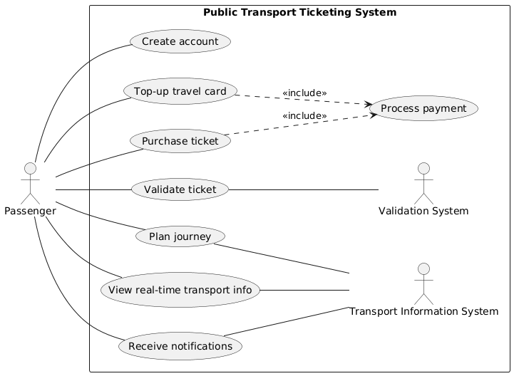
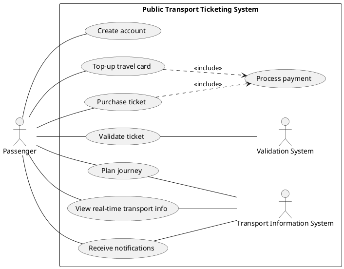
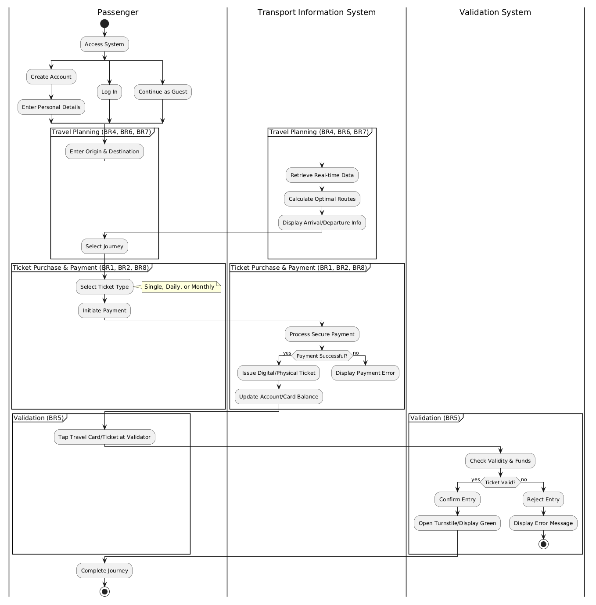
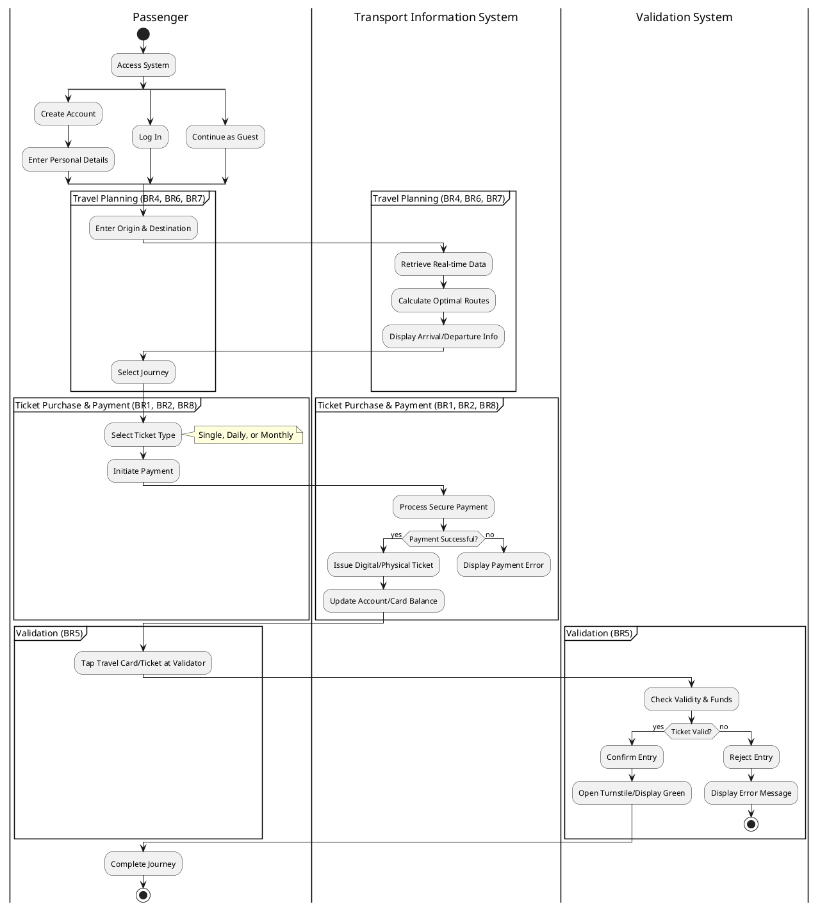
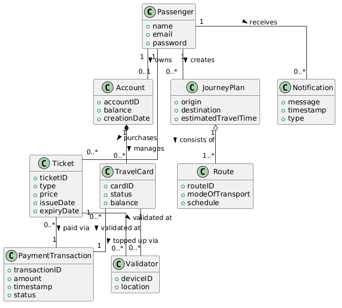
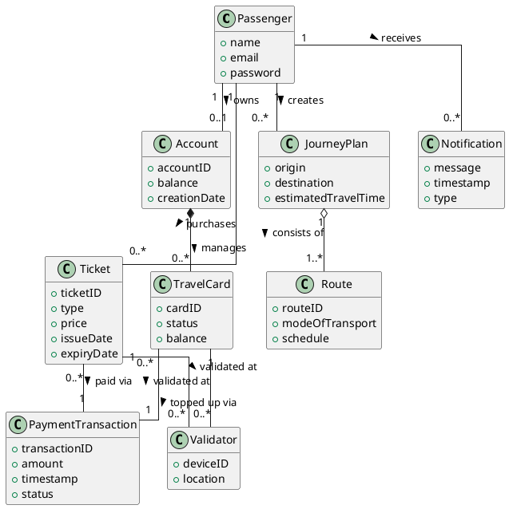

# Project Activity 1

The topic of my project is **Public Transportation Ticketing System**.

## Business Agents

- Validation System
- Transport Information System

## Business Actors

- Passenger

## Business Activities

- Buy tickets/travel cards
- Create an account
- Top-up travel cards
- Plan journey
- Search optimal routes
- Receive travel notifications
- Display arrival/departure information
- Validate ticket
- View real-time transport information

## Business Processes
- **Account Management**:
  - *(Optionally)* Passenger creates an account
  - Passenger logs in
  - Passenger manages travel card
  - Passenger tops up balance
- **Ticket Purchase**:
  - Passenger chooses where to buy a ticket
  - Passenger selects ticket type
  - System processes payment
  - System issues a physical/digital ticket
- **Travel Planning**:
  - Passenger enters a starting point and destination
  - System retrieves real-time transport information
  - System calculates optimal routes
  - System outputs journey options
- **Ticket Validation**:
  - Passenger taps travel card at validator 
  - System checks validity
  - System confirms or rejects entry
- **Travel Information Update**:
  - System receives real-time transport data
  - System updates arrival/departure time
  - Information is displayed on information screens at stations or in mobile app

## Business Rules

| Code     | Rule    |
| -------- | ------- |
| BR1      | Passengers must be allowed to purchase tickets for single journeys, daily passes, or monthly travelcards. |
| BR2      | Ticket purchases must be available through self-service kiosks, mobile apps, or the official website. |
| BR3      | Passengers must be able to create personal accounts, and to manage them. |
| BR4      | Passengers must be able to view estimated travel times, and find optimal routes using various modes of public transport. |
| BR5      | Passengers must validate their travel cards or tickets on designated readers at entry and exit points. |
| BR6      | Passengers must be able to have an up-to-date public transport arrivals and departures. |
| BR7      | Passengers must be notified about any potential delays and any service disruptions in real time.|
| BR8      | The system must provide secure online payments through integrated payment gateways.|

## Business Use Case Diagram

## Activity Diagram

## Domain Model

