# Project Activity 2

The topic of my project is **Public Transportation Ticketing System**.

## 2a. Software Use Case Diagram

### Software Agents

- Passenger
- Validation System
- Transport Information System

### Software Use Case Diagram

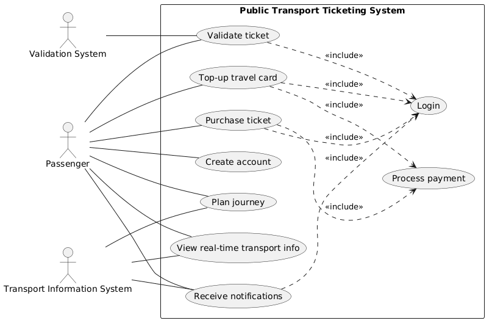

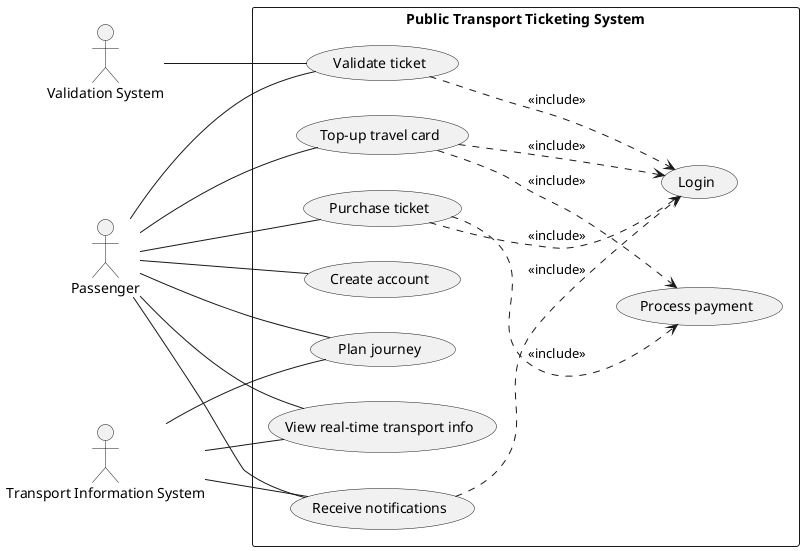

## 2b. Detailed functional requirements

|**Functional Requirement**   |**Grade**   |
|---|---|
|**1. Create account**   |   |
| 1A System allows user to enter email and password for registration.  |   |
| 1B System stores new user credentials in the passenger database.  |   |
|**2. Login**   |   |
| 2A System allows users to authenticate using email and password.  |   |
| 2B System displays an error message for incorrect credentials.  |   |
| 2C System allows users to reset the password in case password has been forgotten.  |   |
| 2D System allows to enter without authentication (as a guest), but with limited fucntionality.  |   |
|**3. Top-up travel card**   |   |
| 3A System allows user to select a top-up amount and payment method.  |   |
| 3B System communicates with the payment gateway to authorize the transaction.  |   |
| 3C System updates the balance of the linked travel card upon success.  |   |
|**4. Purchase Ticket**   |   |
| 4A System displays available ticket types (Single, Daily, Monthly).  |   |
| 4B System verifies if there are sufficient funds for a chosen ticket type.  |   |
| 4C System updates the balance of the linked travel card upon success.  |   |
| 4D System generates a unique digital QR code for the purchased ticket and stores it. |   |
|**5. Plan Journey**   |   |
| 5A System allows user to input starting point and destination.  |   |
| 5B System computes and displays the optimal route and estimated travel time  |   |
|**6. View real-time transport info**   |   |
| 6A System fetches arrival and departure data from the *Transport Information System*.  |   |
| 6B System displays real-time delays or service disruptions.  |   |
|**7. Validate ticket**   |   |
| 7A System allows user to fetch tickets and to choose one.  |   |
| 7A System reads ticket data from the *Validation System* at entry/exit points.  |   |
| 7B System verifies if the ticket is within its validity period.  |   |
| 7C System sends a "confirm" or "reject" signal to the physical turnstile/reader.  |   |
|**8. Receive notifications**   |   |
| 8A System sends notifications for relevant service alerts.  |   |
| 8B System sends notifications to user about routes/transport have been subscribed.  |   |
|**9. Process payment**   |   |
| 9A System communicates with the external payment gateway to authorize transactions.  |   |
| 9B System records the transaction details (ID, amount, status) in the payment history.  |   |
| 9C System handles payment failures by notifying the user and canceling the pending order.  |   |

## 2c. Non-functional Requirements
- **AV1**: The system shall have an availability of 99.99% during operational hours (52.56 minutes of downtime per year).
- **PERF1**: System response time for ticket validation is less than 0.3 seconds to ensure smooth passenger flow.
- **REL1**: System has an MTBF of 5000 hours (~ 7 months)

> SEC0: Users can only access the functions of the web application for which they have sufficient rights. Each user has a role?

- **SEC1**: Users login in via email and password.
- **SEC2**: All payment data in flight must be encrypted using HTTPS.
- **SEC3**: User passwords are not stored in clear-text; they must be encrypted with a unidirectional hash.
- **CAP1**: System is able to store data for up to 50,000 active passengers and their related transactions.
- **USA1**: A first-time user is able to purchase a ticket within 2 minutes of opening the app.
- **USA2**: System can be set for Romanian, English or French.

## 2d. Use Case Description
### UC1. Create Account
- **ID**: UC1
- **Name**: Create Account
- **Description**: A new user provides personal details to the system to create a personal profile for managing tickets and travel cards.
- **Actors**: Passenger
- **Preconditions**: User is not currently logged in and has access to the app, or website.
- **Postconditions**: A new user record is created in the database, and user is automatically logged in or redirected to the login page.
- **Main flow**: 
|**Passenger**   |**System** |
|---|---|
|1. Selects "Sign Up" |2. System allows user to enter name, email, and password for registration.   |
|3. Enters personal details and submits the form. [A1, A2] | 4. System stores new user credentials in the passenger database.   |
| | 5. Displays a "Registration Successful" message.   |

- **Alternate flows**: *A1*: if the email format is incorrect or the password is too short, System displays a validation error and asks the user to correct the fields. *A2*: if the email is already registered in the database, System informs the user and suggests logging in instead.
- **Frequency**: Medium
- **Priority**: High
### UC2. Login
- **ID**: UC2
- **Name**: Login
- **Description**: An existing user authenticates to the system to access personal account, travel cards, and purchased tickets.
- **Actors**: Passenger
- **Preconditions**: 1. User has already created an account. 2. User is not currently authenticated.
- **Postconditions**: 1. User is granted access to personalized private features. 2. A secure session is established.
- **Main flow**: 
|**Passenger**   |**System** |
|---|---|
|1. Navigates to the login screen.  |2. System allows users to authenticate using username (email) and password. |
|3. Enters credentials and clicks "Login". [A1, A2]  | |
|  |4. System validates credentials against the database. |
|  |5. System starts a user session. |
|  |6. System redirects user to the personal dashboard. |

- **Alternate flows**: A1: if the password or email is wrong, System displays an error message for incorrect credentials and allows the user to try again. A2: If the user fails to login 5 times, the System locks the account for 15 minutes for security.
- **Frequency**: Medium
- **Priority**: High
### UC3. Top-up travel card
- **ID**: UC3
- **Name**: Top-up travel card
- **Description**: A logged-in passenger adds funds to their travel card balance using an external payment provider.
- **Actors**: Passenger, (Payment Gateway???(but it's not a software actor))
- **Preconditions**: 1. Passenger is logged in. 2. Passenger has a linked travel card.
- **Postconditions**: 1. Travel card balance is increased by the specified amount. 2. Transaction is logged in the payment history.
- **Main flow**: 
|**Passenger**   |**System** |
|---|---|
|1. Selects "Top-up" and enters the desired amount.  | |
|2. Selects payment method. [A1]  | |
|  |3. Redirects to payment gateway for authorization. |
|4. Enters payment details and confirms. [A1, A2]  | |
|  |5. Processes transaction and returns "Success" token. |
|  |6. Updates the balance of the linked travel card. |
|  |7. Records the transaction details in the history. |
|8. Receives confirmation message and updated balance.  | |

> How to handle `Process payment` better?

- **Alternate flows**: A1: if user cancels on the payment page, system returns the user to the dashboard without charging. A2: if the gateway returns an error (e.g timeout, insufficient funds), system notifies the user and the balance remains unchanged.
- **Frequency**: High
- **Priority**: High
### UC4. Purchase Ticket
- **ID**: UC4
- **Name**: Purchase Ticket
- **Description**: A passenger selects and pays for a specific type of ticket.
- **Actors**: Passenger
- **Preconditions**: 1. Passenger is logged in (or using a kiosk).
- **Postconditions**: 1. A new ticket (QR) is generated and stored in the user's account. 2. Transaction is logged in the payment history.
- **Main flow**: 
|**Passenger**   |**System** |
|---|---|
|1. Selects "Buy Ticket".  | |
|  |2. Displays available ticket types. |
|3. Selects the ticket type and quantity.  | |
|  |5. Initiates internal payment. |
|6. Confirms payment process. [A1]  | |
|  |7. Confirms successful transaction.|
|  |8. Generates a unique digital QR code for the ticket.|
|9. Views the digital ticket.  | |

- **Alternate flows**: A1: if payment fails (e.g. insufficient funds), the system provides an error and no ticket is generated.
- **Frequency**: High
- **Priority**: High
### UC5. Plan Journey
- **ID**: UC5
- **Name**: Plan Journey
- **Description**: A user (anonymous or logged in) inputs a starting point and a destination to receive the best travel routes using buses, trains, or subways.
- **Actors**: Passenger, Transport Information System   
- **Preconditions**: System has access to the internet to fetch real-time data from the Transport Information System.
- **Postconditions**: System displays one or more route options with estimated travel times.
- **Main flow**: 
|**Passenger**   |**Transport Information System** | **System** |
|---|---|---|
|1. Selects "Plan Journey"  |   |   |
|2. Enters starting location and destination. [A1]  | |   |
|  |4. Sends the current data | 3. Requests current schedules and traffic data |
|  | | 5. Computes optimal routes based on time and mode preferences. |
|6. Views the suggested routes and estimated travel times.  | | |

- **Alternate flows**: A1: if there is a problem (e.g. loss of connectivity) in Transport Information System, System sends the error message to user.
- **Frequency**: High
- **Priority**: Medium

### UC6. View Real-time Transport Info
- **ID**: UC6
- **Name**: View Real-time Transport Info
- **Description**: User checks the live arrival and departure board for a specific station or stop.
- **Actors**: Passenger, Transport Information System   
- **Preconditions**: System has access to the internet to fetch real-time data from the Transport Information System.
- **Postconditions**: Live board is displayed with up-to-the-minute data.
- **Main flow**: 
|**Passenger**   |**Transport Information System** | **System** |
|---|---|---|
|1. Selects a specific station or bus stop on the map/list. [A1]  |   |   |
|  |3. Sends the current data | 2. Fetches arrival/departure data for that location |
|  | | 5. Displays the list of upcoming vehicles and any active delays. |
|6. Views the real-time countdown to arrival.  | | |

- **Alternate flows**: A1: If Transport Information System is down, System displays the scheduled (static) time with a warning that real-time tracking is currently unavailable.
- **Frequency**: Very high
- **Priority**: Medium

### UC7. Validate Ticket
- **ID**: UC7
- **Name**: Validate Ticket
- **Description**: The process of verifying a physical or digital ticket at a transit point to grant or deny access to a passenger.
- **Actors**: Passenger, Validation System
- **Preconditions**: 1. Passenger is at the entry/exit gate. 2. Passenger has an active ticket.
- **Postconditions** 1. Access is granted/denied. 2. Entry/Exit event is logged in the system.
- **Main flow**: 
|**Passenger**   |**Validation System** | **System** |
|---|---|---|
|1. Scans QR code on the reader.   |2. Read the QR code data and infer the ticket.   |   |
|  |3. Send the request on the ticket to the system | 4. Verifies if the ticket is within its validity period [A1]  |
|  |6. Receives the response | 5. Approves the ticket  |
|8. Passes through the gate  |7. Shows positive signal and opens the gate at the entry point |  |

- **Alternate flows**: A1. If the ticket is expired, the system sends a "reject" signal. The Validation System displays a red light and denies entry.
- **Frequency**: Extremely High
- **Priority**: High

### UC8. Receive Notifications
- **ID**: UC8
- **Name**: Receive Notifications
- **Description**: System pushes relevant alerts to user regarding service changes or account status.
- **Actors**: Passenger, Transport Information System   
- **Preconditions**: Notification permissions are granted.
- **Postconditions**: User is alerted of a specific event.
- **Main flow**: 
|**Passenger**   |**Transport Information System** | **System** |
|---|---|---|
| | 1. Identifies a delay or disruption.   |   |
|  |2. Sends the current data | 3. Pushes a notification to all affected Passengers. |
|4. Taps the notification to see full details.  | | |

- **Alternate flows**: -
- **Frequency**: Low to Medium
- **Priority**: Low

> I am not sure if it is needed.
### UC9. Process Payment
- **ID**: UC9
- **Name**: Process Payment
- **Description**: The internal process of probable connection to an external provider to authorize a financial transaction and recording the result.
- **Actors**: Passenger 
- **Preconditions**: A payment-related use case has been initiated.
- **Postconditions**: The transaction is either "Completed" or "Failed."
- **Main flow**: 
|**Passenger**  | **System** |
|---|---|
| 1. Enters payment details [A1]  |   |
|  |2. Sends authorization request to the Payment Gateway.   |
| 3. Completes external authentication (if required) [A2]. |   |
|  | 4. Records transaction details in the database.   |
|  | 5. Returns control to the primary use case   |

- **Alternate flows**: A1: if the gateway returns "Insufficient Funds" or "Expired Card", system records the failure, notifies the user, and stops the process. A2: if the gateway doesn't respond within 30 seconds, system logs a "Pending/Timeout" status and asks the user to check their history later.
- **Frequency**: High
- **Priority**: High

## 2e. System Sequence Diagram
### UC1. Create Account
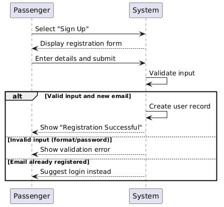

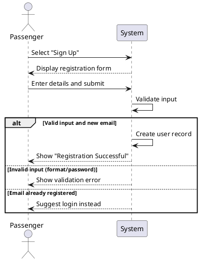

### UC2. Login
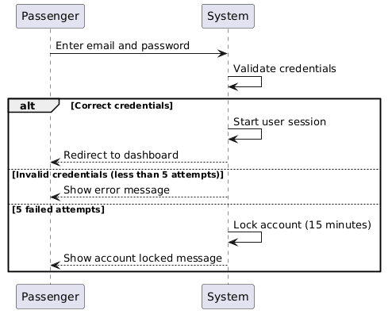
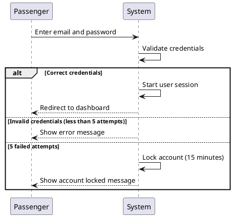

### UC3. Top-up travel card
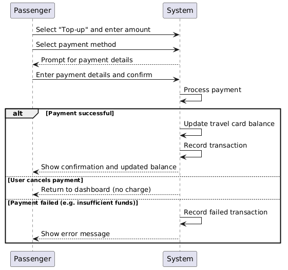
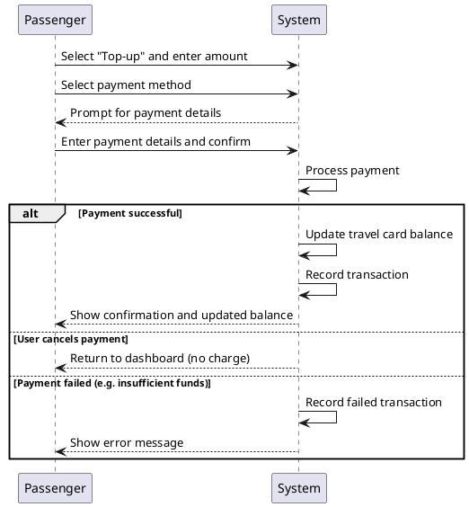
### UC4. Purchase Ticket
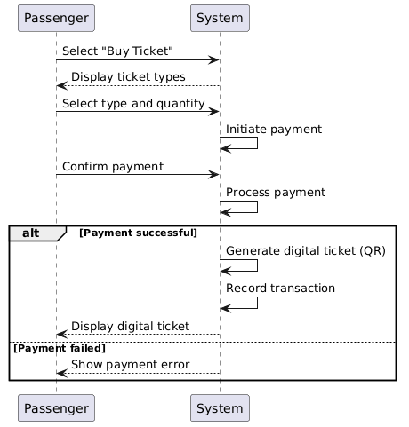
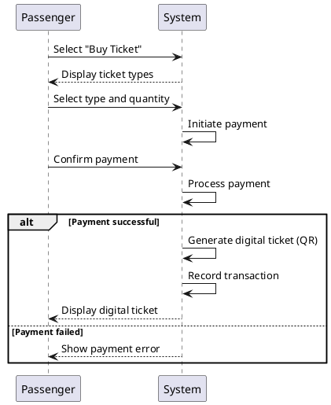

### UC5. Plan Journey
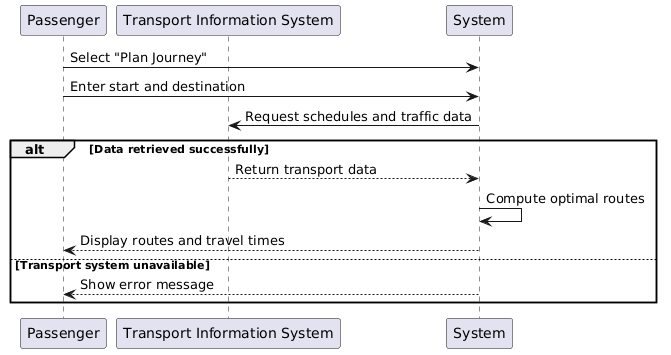
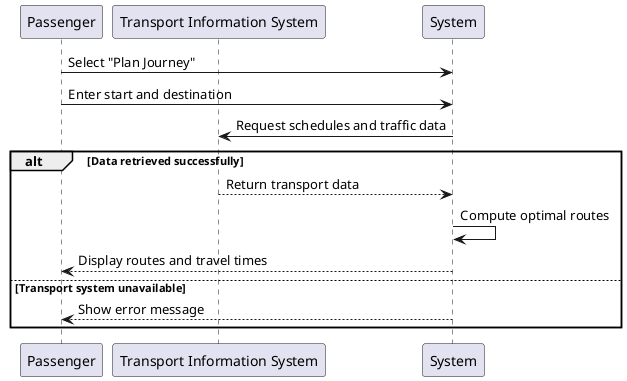

### UC6. View Real-time Transport Info
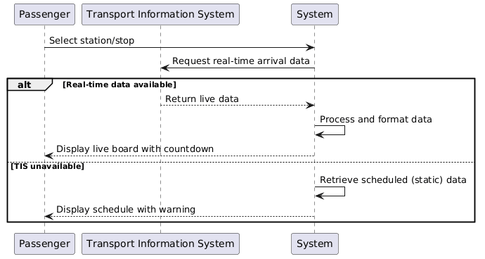
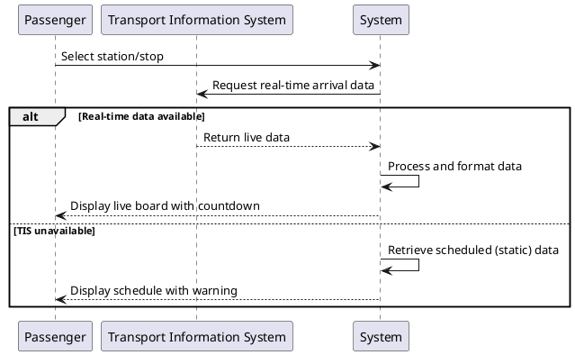

### UC7. Validate Ticket
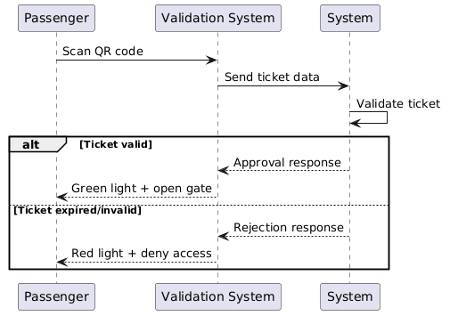
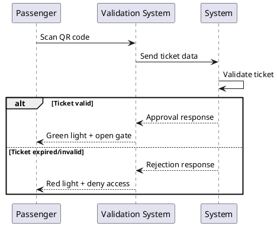

### UC8. Receive Notifications
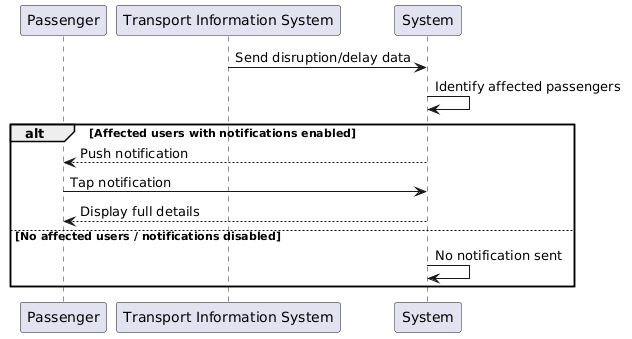
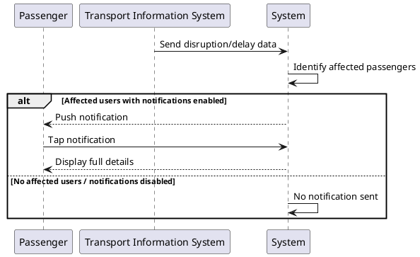

> I'm not sure if it is needed.
### UC9. Process Payment
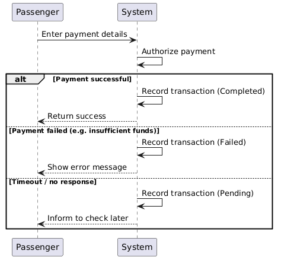
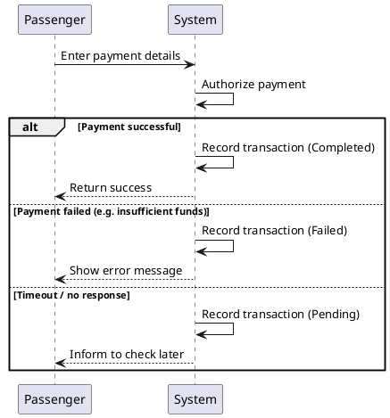

## 2f. Operation contracts
### UC3. Top-up travel card
**Operation**: topUp(cardID, amount)
**Cross reference**: Use Case 3. Top-up Travel Card
**Precondition**: 1. Passenger is authenticated. A TravelCard with `cardID` is associated with the Passenger's Account. 3. Payment gateway has returned a "Success" status for the amount.
**Postcondition**: 1. An instance `t` of Transaction was created. 2. `t.amount` becomes `amount`. 3. `t.type` becomes "Credit/Top-up". 4. `t.timestamp` becomes the current time. 5. `Account.balance` associated with the travel card was increased by `amount`. 6. `t` is associated with the account (to track history).
### UC7. Validate ticket
**Operation**: validateTicket(ticketID, deviceID)
**Cross reference**: Use Case 7. Validate ticket
**Precondition**: A ticket with `ticketID` exists; a validator with `deviceID` exists.
**Postcondition**: 1. An instance v of ValidationLog was created. 2. v was associated with the Ticket and the Validator. 3. v.timestamp became the current time. 4. (If Single Trip) Ticket `status` becomes "used". 5. ValidationLog.status became "Approved" or "Rejected" based on rules.