# Project Activity 3

The topic of my project is **Public Transportation Ticketing System**.

## 3a. Design class diagram

### UC1. Create Account

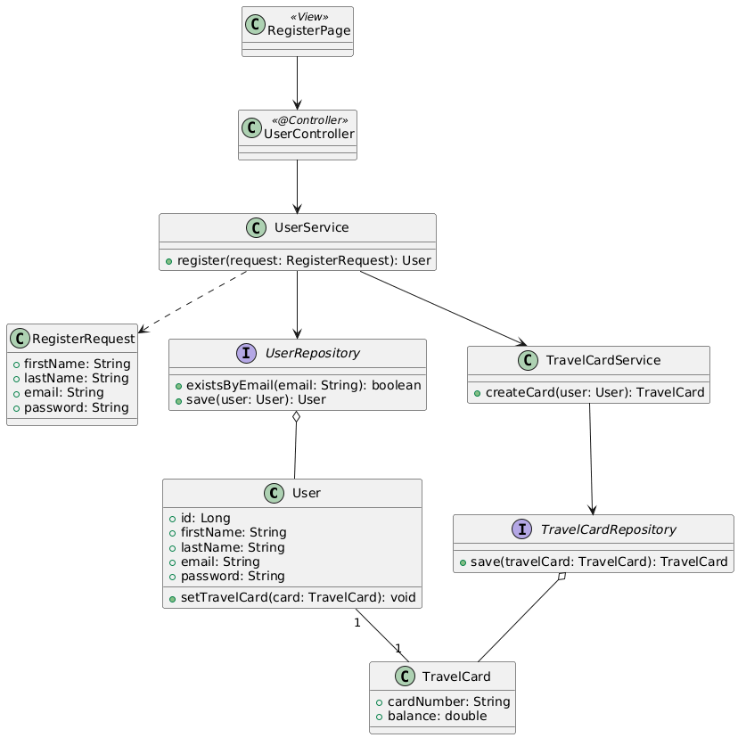

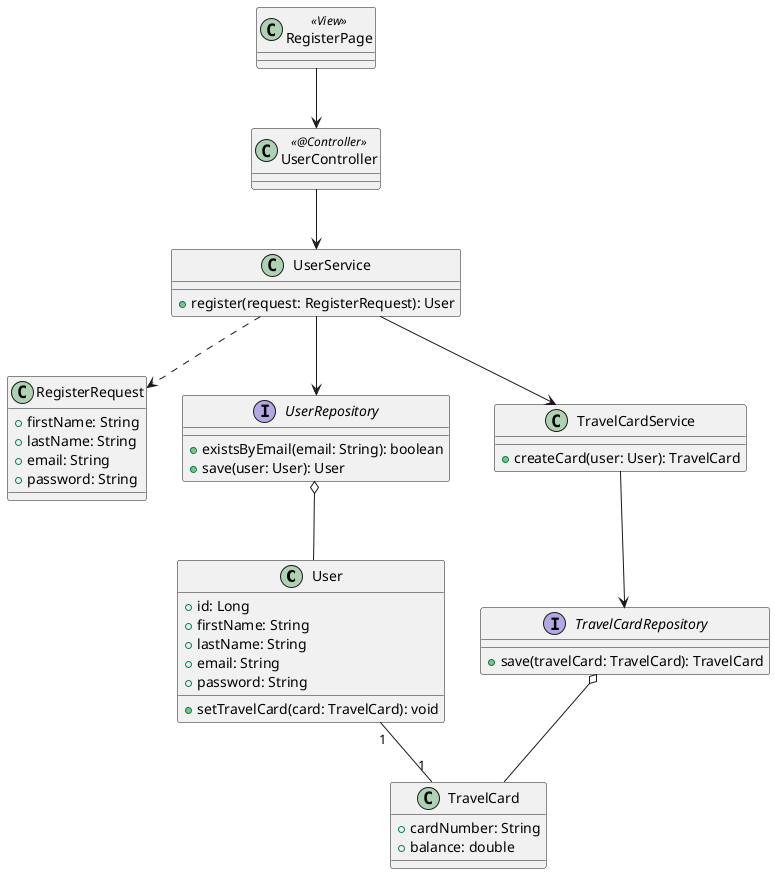
```plantuml
@startuml
class User {
    +id: Long
    +firstName: String
    +lastName: String
    +email: String
    +password: String
    +setTravelCard(card: TravelCard): void
}

class TravelCard {
    +cardNumber: String
    +balance: double
}

class RegisterRequest {
    +firstName: String
    +lastName: String
    +email: String
    +password: String
}

interface UserRepository {
    +existsByEmail(email: String): boolean
    +save(user: User): User
}

interface TravelCardRepository {
    +save(travelCard: TravelCard): TravelCard
}

class UserService {
    +register(request: RegisterRequest): User
}

class TravelCardService {
    +createCard(user: User): TravelCard
}

class UserController <<@Controller>> {
}

class RegisterPage <<View>> {
}

User "1" -- "1" TravelCard
UserService --> UserRepository
UserService --> TravelCardService
UserController --> UserService
RegisterPage --> UserController
UserService ..> RegisterRequest
UserRepository o-- User
TravelCardRepository o-- TravelCard
TravelCardService --> TravelCardRepository
@enduml
```

### UC2. Login

> Should I have merged LoginAttemptService with UserService and don't create a separate entity?

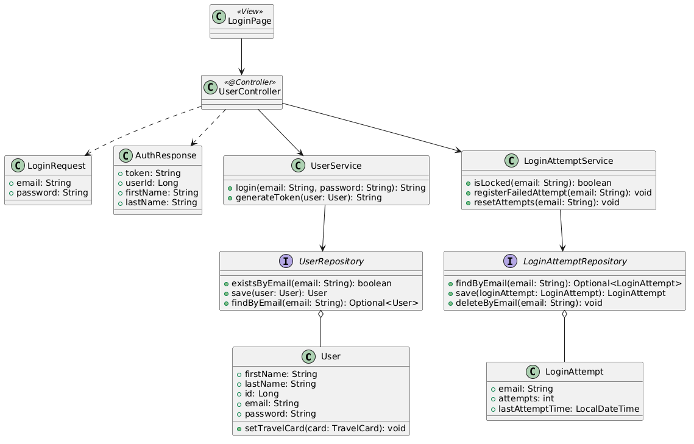

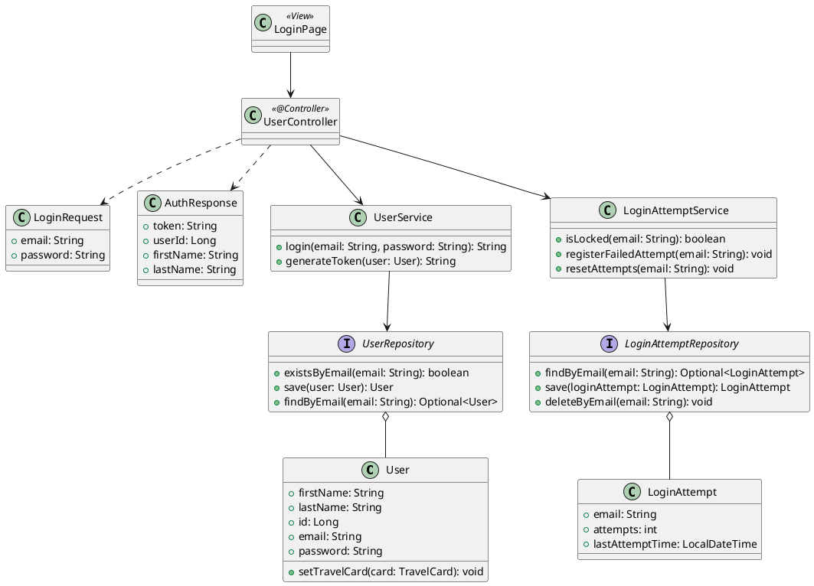
```plantuml
@startuml
class User {
    +firstName: String
    +lastName: String
    +id: Long
    +email: String
    +password: String
    +setTravelCard(card: TravelCard): void
}


class LoginRequest {
    +email: String
    +password: String
}

class AuthResponse {
    +token: String
    +userId: Long
    +firstName: String
    +lastName: String
}

interface UserRepository {
    +existsByEmail(email: String): boolean
    +save(user: User): User
    +findByEmail(email: String): Optional<User>
}

class UserService {
    +login(email: String, password: String): String
    +generateToken(user: User): String
}

class LoginAttemptService {
    +isLocked(email: String): boolean
    +registerFailedAttempt(email: String): void
    +resetAttempts(email: String): void
}

class UserController <<@Controller>> {
}

class LoginPage <<View>> {
}

class LoginAttempt {
    +email: String
    +attempts: int
    +lastAttemptTime: LocalDateTime
}

interface LoginAttemptRepository {
    +findByEmail(email: String): Optional<LoginAttempt>
    +save(loginAttempt: LoginAttempt): LoginAttempt
    +deleteByEmail(email: String): void
}


UserService --> UserRepository
UserController --> UserService
UserController --> LoginAttemptService
LoginPage --> UserController
UserController ..> LoginRequest
UserController ..> AuthResponse
UserRepository o-- User
LoginAttemptService --> LoginAttemptRepository
LoginAttemptRepository o-- LoginAttempt

@enduml
```

### UC3. Top-up Travel Card

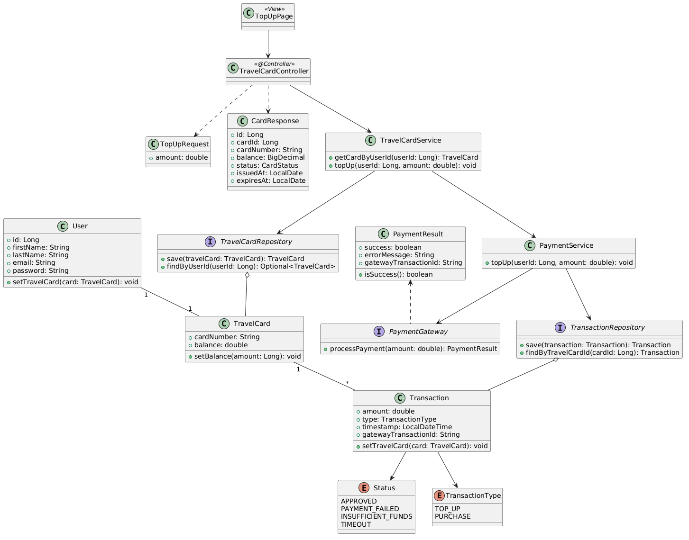

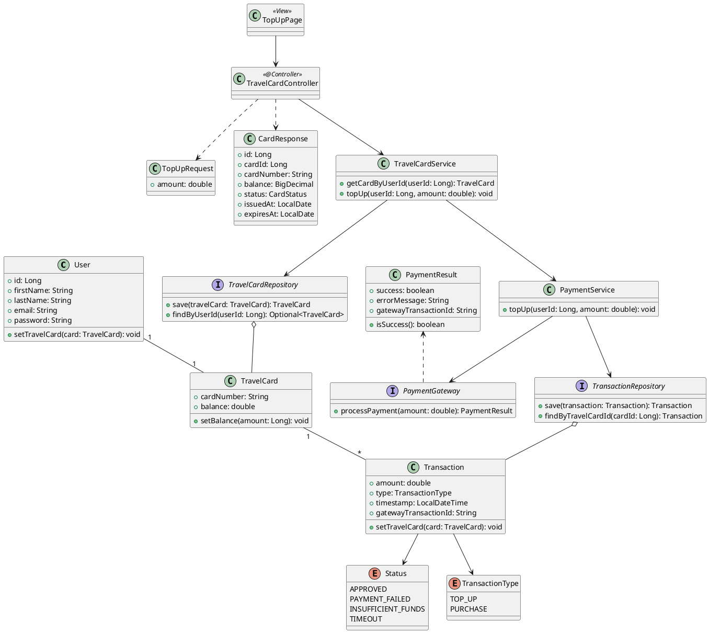
```plantuml
@startuml
class User {
    +id: Long
    +firstName: String
    +lastName: String
    +email: String
    +password: String
    +setTravelCard(card: TravelCard): void
}

class TravelCard {
    +cardNumber: String
    +balance: double
    +setBalance(amount: Long): void
}

class Transaction {
    +amount: double
    +type: TransactionType
    +timestamp: LocalDateTime
    +gatewayTransactionId: String
    +setTravelCard(card: TravelCard): void
}

class TopUpRequest {
    +amount: double
}

class CardResponse {
    +id: Long
    +cardId: Long
    +cardNumber: String
    +balance: BigDecimal
    +status: CardStatus
    +issuedAt: LocalDate
    +expiresAt: LocalDate
}

class PaymentResult {
    +success: boolean
    +errorMessage: String
    +gatewayTransactionId: String
    +isSuccess(): boolean
}


enum Status {
    APPROVED
    PAYMENT_FAILED
    INSUFFICIENT_FUNDS
    TIMEOUT
}

enum TransactionType {
    TOP_UP
    PURCHASE
}


interface TravelCardRepository {
    +save(travelCard: TravelCard): TravelCard
    +findByUserId(userId: Long): Optional<TravelCard>
}

interface TransactionRepository {
    +save(transaction: Transaction): Transaction
    +findByTravelCardId(cardId: Long): Transaction
}

interface PaymentGateway {
    +processPayment(amount: double): PaymentResult
}


class TravelCardService {
    +getCardByUserId(userId: Long): TravelCard
    +topUp(userId: Long, amount: double): void
}

class PaymentService {
    +topUp(userId: Long, amount: double): void
}


class TravelCardController <<@Controller>> {
}


class TopUpPage <<View>> {
}

User "1" -- "1" TravelCard
TravelCard "1" -- "*" Transaction

Transaction --> Status
Transaction --> TransactionType

TravelCardService --> TravelCardRepository
TravelCardController --> TravelCardService
TravelCardService --> PaymentService

PaymentService --> TransactionRepository
PaymentService --> PaymentGateway

TravelCardController ..> CardResponse
TravelCardController ..> TopUpRequest

TravelCardRepository o-- TravelCard
TransactionRepository o-- Transaction

TopUpPage --> TravelCardController

PaymentResult <.. PaymentGateway
@enduml
```

### UC4. Purchase Ticket

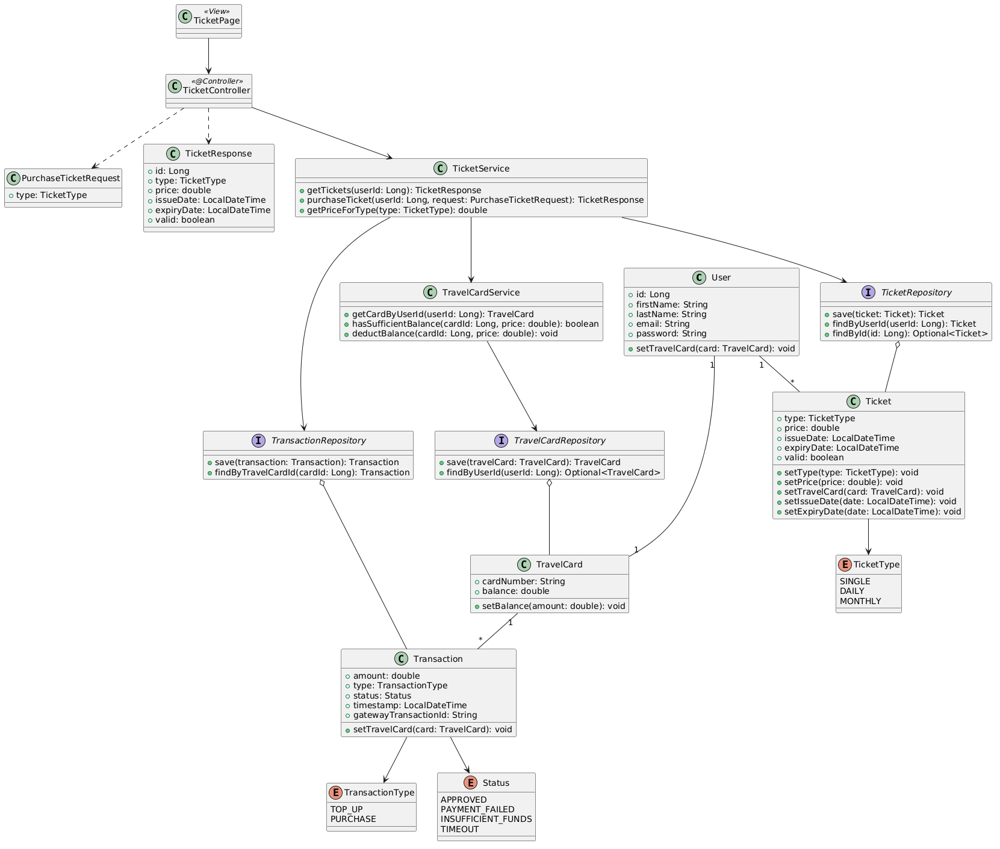

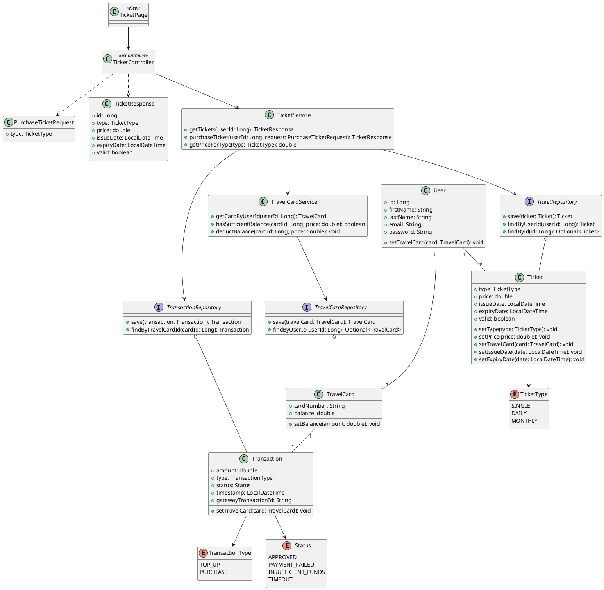
```plantuml
@startuml
class User {
    +id: Long
    +firstName: String
    +lastName: String
    +email: String
    +password: String
    +setTravelCard(card: TravelCard): void
}

class TravelCard {
    +cardNumber: String
    +balance: double
    +setBalance(amount: double): void
}

class Ticket {
    +type: TicketType
    +price: double
    +issueDate: LocalDateTime
    +expiryDate: LocalDateTime
    +valid: boolean
    +setType(type: TicketType): void
    +setPrice(price: double): void
    +setTravelCard(card: TravelCard): void
    +setIssueDate(date: LocalDateTime): void
    +setExpiryDate(date: LocalDateTime): void
}

class Transaction {
    +amount: double
    +type: TransactionType
    +status: Status
    +timestamp: LocalDateTime
    +gatewayTransactionId: String
    +setTravelCard(card: TravelCard): void
}

class PurchaseTicketRequest {
    +type: TicketType
}

class TicketResponse {
    +id: Long
    +type: TicketType
    +price: double
    +issueDate: LocalDateTime
    +expiryDate: LocalDateTime
    +valid: boolean
}


enum TransactionType {
    TOP_UP
    PURCHASE
}

enum TicketType {
    SINGLE
    DAILY
    MONTHLY
}

enum Status {
    APPROVED
    PAYMENT_FAILED
    INSUFFICIENT_FUNDS
    TIMEOUT
}

interface TravelCardRepository {
    +save(travelCard: TravelCard): TravelCard
    +findByUserId(userId: Long): Optional<TravelCard>
}

interface TransactionRepository {
    +save(transaction: Transaction): Transaction
    +findByTravelCardId(cardId: Long): Transaction
}

interface TicketRepository {
    +save(ticket: Ticket): Ticket
    +findByUserId(userId: Long): Ticket
    +findById(id: Long): Optional<Ticket>
}


class TravelCardService {
    +getCardByUserId(userId: Long): TravelCard
    +hasSufficientBalance(cardId: Long, price: double): boolean
    +deductBalance(cardId: Long, price: double): void
}

class TicketService {
    +getTickets(userId: Long): TicketResponse
    +purchaseTicket(userId: Long, request: PurchaseTicketRequest): TicketResponse
    +getPriceForType(type: TicketType): double
}


class TicketController <<@Controller>> {
}

class TicketPage <<View>> {
}

User "1" -- "1" TravelCard
User "1" -- "*" Ticket
TravelCard "1" -- "*" Transaction

Transaction --> Status
Transaction --> TransactionType
Ticket --> TicketType

TravelCardService --> TravelCardRepository
TravelCardRepository o-- TravelCard
TicketController --> TicketService

TicketService --> TicketRepository
TicketService --> TravelCardService
TicketService --> TransactionRepository

TicketController ..> PurchaseTicketRequest
TicketController ..> TicketResponse

TransactionRepository o-- Transaction
TicketRepository o-- Ticket

TicketPage --> TicketController

@enduml
```

### UC5. Plan Journey

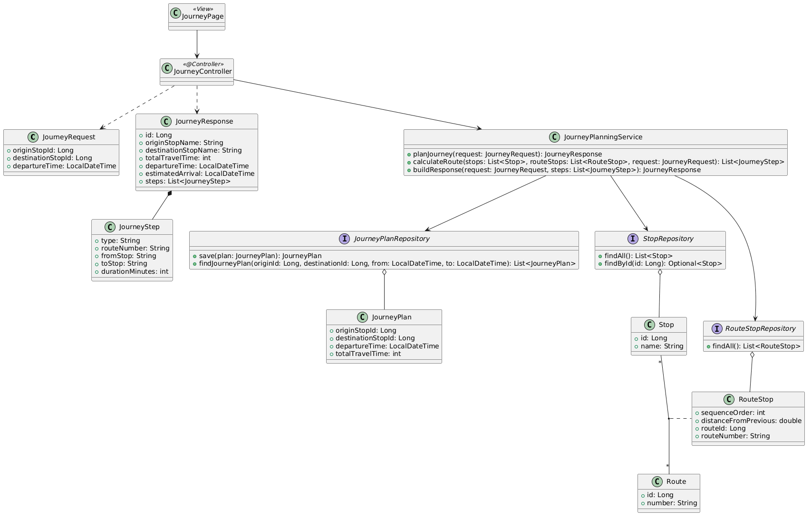

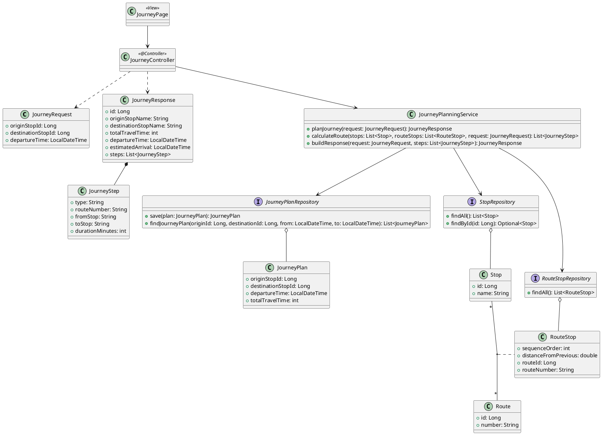
```plantuml
@startuml
class JourneyRequest {
    +originStopId: Long
    +destinationStopId: Long
    +departureTime: LocalDateTime
}
class JourneyResponse {
    +id: Long
    +originStopName: String
    +destinationStopName: String
    +totalTravelTime: int
    +departureTime: LocalDateTime
    +estimatedArrival: LocalDateTime
    +steps: List<JourneyStep>
}
class JourneyStep {
    +type: String
    +routeNumber: String
    +fromStop: String
    +toStop: String
    +durationMinutes: int
}
class JourneyPlan {
    +originStopId: Long
    +destinationStopId: Long
    +departureTime: LocalDateTime
    +totalTravelTime: int
}
class Stop {
    +id: Long
    +name: String
}
class RouteStop {
    +sequenceOrder: int
    +distanceFromPrevious: double      
    +routeId: Long 
    +routeNumber: String
}
interface JourneyPlanRepository {
    +save(plan: JourneyPlan): JourneyPlan
    +findJourneyPlan(originId: Long, destinationId: Long, from: LocalDateTime, to: LocalDateTime): List<JourneyPlan>
}
interface StopRepository {
    +findAll(): List<Stop>
    +findById(id: Long): Optional<Stop>
}
interface RouteStopRepository {
    +findAll(): List<RouteStop>
}
class JourneyPlanningService {
    +planJourney(request: JourneyRequest): JourneyResponse
    +calculateRoute(stops: List<Stop>, routeStops: List<RouteStop>, request: JourneyRequest): List<JourneyStep>
    +buildResponse(request: JourneyRequest, steps: List<JourneyStep>): JourneyResponse
}
class JourneyController <<@Controller>> {
}
class JourneyPage <<View>> {
}

class Route {
    +id: Long
    +number: String
}

JourneyPlanningService --> JourneyPlanRepository
JourneyPlanningService --> StopRepository
JourneyPlanningService --> RouteStopRepository
JourneyController --> JourneyPlanningService
JourneyPage --> JourneyController
JourneyController ..> JourneyRequest
JourneyController ..> JourneyResponse
JourneyPlanRepository o-- JourneyPlan
StopRepository o-- Stop
RouteStopRepository o-- RouteStop
JourneyResponse *-- JourneyStep

Stop "*" -- "*" Route
(Stop, Route) .. RouteStop
@enduml
```

### UC6. View Real-time Transport Info

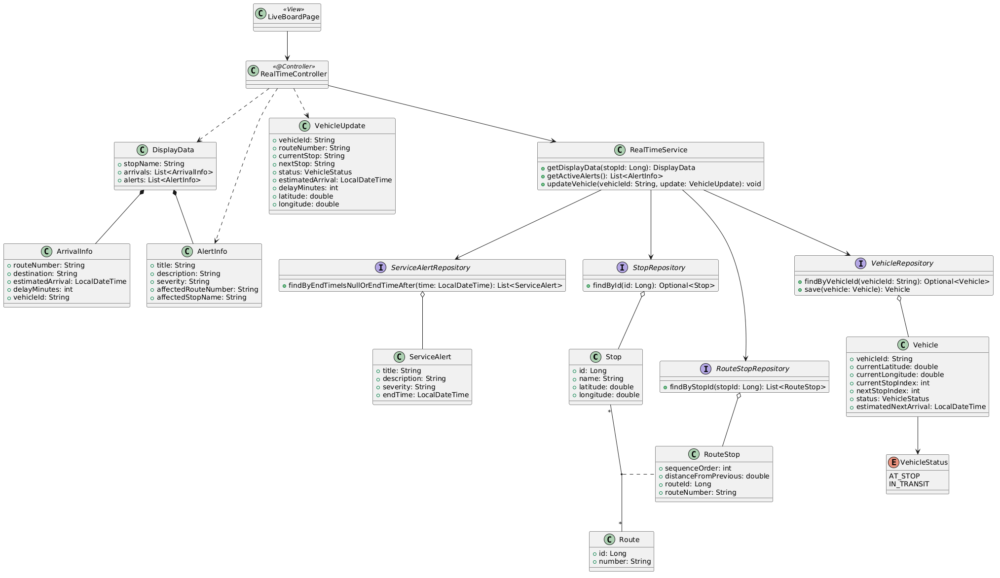

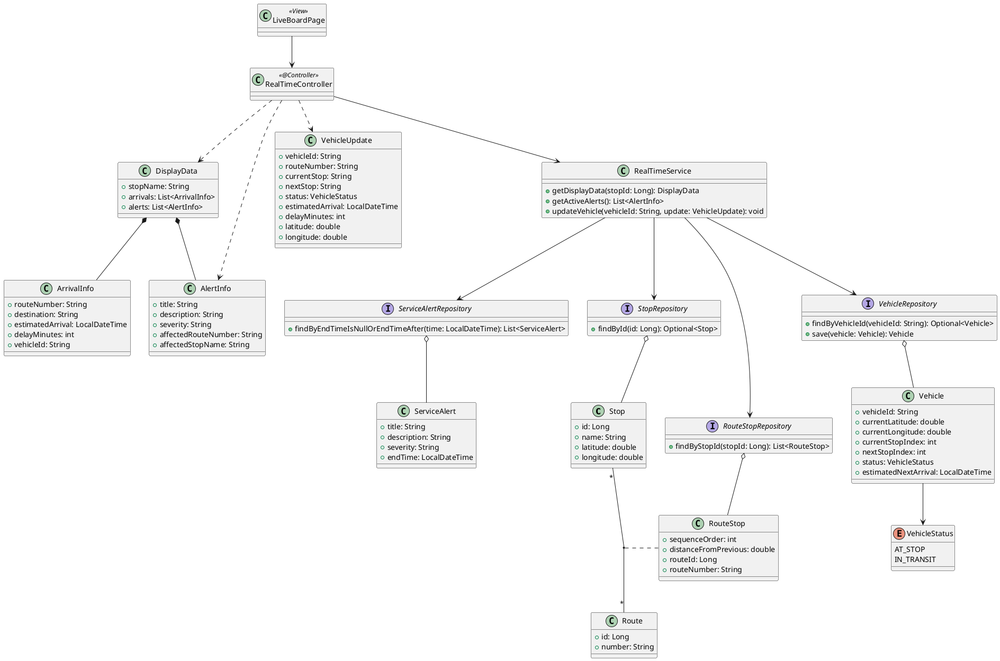
```plantuml
@startuml
class Stop {
    +id: Long
    +name: String
    +latitude: double
    +longitude: double
}

class Vehicle {
    +vehicleId: String
    +currentLatitude: double
    +currentLongitude: double
    +currentStopIndex: int
    +nextStopIndex: int
    +status: VehicleStatus
    +estimatedNextArrival: LocalDateTime
}

class ServiceAlert {
    +title: String
    +description: String
    +severity: String
    +endTime: LocalDateTime
}

class DisplayData {
    +stopName: String
    +arrivals: List<ArrivalInfo>
    +alerts: List<AlertInfo>
}

class ArrivalInfo {
    +routeNumber: String
    +destination: String
    +estimatedArrival: LocalDateTime
    +delayMinutes: int
    +vehicleId: String
}

class AlertInfo {
    +title: String
    +description: String
    +severity: String
    +affectedRouteNumber: String
    +affectedStopName: String
}

class VehicleUpdate {
    +vehicleId: String
    +routeNumber: String
    +currentStop: String
    +nextStop: String
    +status: VehicleStatus
    +estimatedArrival: LocalDateTime
    +delayMinutes: int
    +latitude: double
    +longitude: double
}

enum VehicleStatus {
    AT_STOP
    IN_TRANSIT
}

interface StopRepository {
    +findById(id: Long): Optional<Stop>
}

interface VehicleRepository {
    +findByVehicleId(vehicleId: String): Optional<Vehicle>
    +save(vehicle: Vehicle): Vehicle
}

interface ServiceAlertRepository {
    +findByEndTimeIsNullOrEndTimeAfter(time: LocalDateTime): List<ServiceAlert>
}

interface RouteStopRepository {
    +findByStopId(stopId: Long): List<RouteStop>
}

class RealTimeService {
    +getDisplayData(stopId: Long): DisplayData
    +getActiveAlerts(): List<AlertInfo>
    +updateVehicle(vehicleId: String, update: VehicleUpdate): void
}

class RealTimeController <<@Controller>> {
}

class LiveBoardPage <<View>> {
}

class RouteStop {
    +sequenceOrder: int
    +distanceFromPrevious: double      
    +routeId: Long 
    +routeNumber: String
}

class Route {
    +id: Long
    +number: String
}

Vehicle --> VehicleStatus
RealTimeService --> StopRepository
RealTimeService --> RouteStopRepository
RealTimeService --> VehicleRepository
RealTimeService --> ServiceAlertRepository
RealTimeController --> RealTimeService
LiveBoardPage --> RealTimeController
RealTimeController ..> VehicleUpdate
RealTimeController ..> AlertInfo
RealTimeController ..> DisplayData
DisplayData *-- ArrivalInfo
DisplayData *-- AlertInfo
StopRepository o-- Stop
RouteStopRepository o-- RouteStop
VehicleRepository o-- Vehicle
ServiceAlertRepository o-- ServiceAlert

Stop "*" -- "*" Route
(Stop, Route) .. RouteStop
@enduml
```

### UC7. Validate Ticket

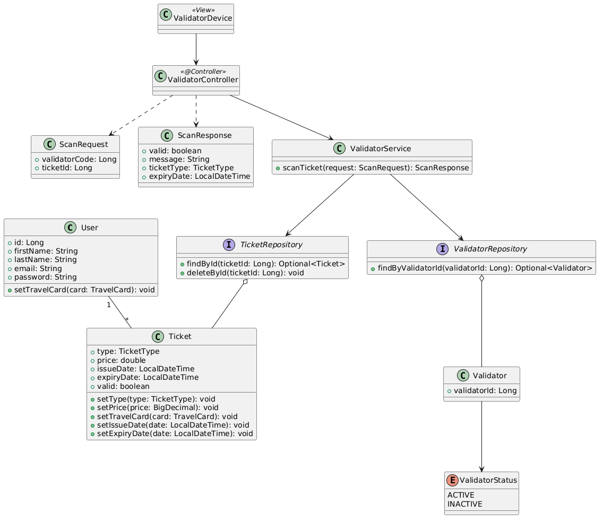

```palntuml
@startuml
class User {
    +id: Long
    +firstName: String
    +lastName: String
    +email: String
    +password: String
    +setTravelCard(card: TravelCard): void
}

class Ticket {
    +type: TicketType
    +price: double
    +issueDate: LocalDateTime
    +expiryDate: LocalDateTime
    +valid: boolean
    +setType(type: TicketType): void
    +setPrice(price: BigDecimal): void
    +setTravelCard(card: TravelCard): void
    +setIssueDate(date: LocalDateTime): void
    +setExpiryDate(date: LocalDateTime): void
}

class Validator {
    +validatorId: Long
}

class ScanRequest {
    +validatorCode: Long
    +ticketId: Long
}

class ScanResponse {
    +valid: boolean
    +message: String
    +ticketType: TicketType
    +expiryDate: LocalDateTime
}

enum ValidatorStatus {
    ACTIVE
    INACTIVE
}

interface ValidatorRepository {
    +findByValidatorId(validatorId: Long): Optional<Validator>
}

interface TicketRepository {
    +findById(ticketId: Long): Optional<Ticket>
    +deleteById(ticketId: Long): void
}

class ValidatorService {
    +scanTicket(request: ScanRequest): ScanResponse
}

class ValidatorController <<@Controller>> {
}

class ValidatorDevice <<View>> {
}

Validator --> ValidatorStatus
ValidatorService --> ValidatorRepository
ValidatorService --> TicketRepository
ValidatorController --> ValidatorService
ValidatorDevice --> ValidatorController
ValidatorController ..> ScanRequest
ValidatorController ..> ScanResponse
ValidatorRepository o-- Validator

User "1" -- "*" Ticket
TicketRepository o-- Ticket
@enduml
```

### UC8. Receive Notifications

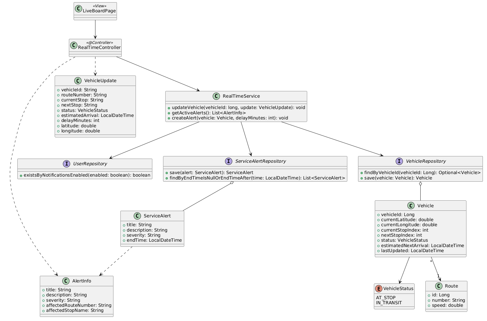

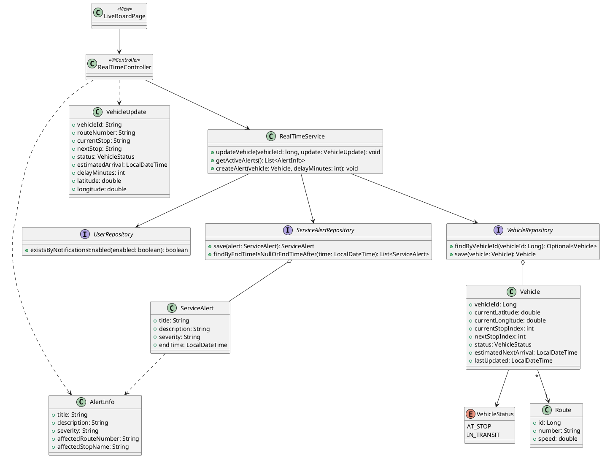
```plantuml
@startuml
class Vehicle {
    +vehicleId: Long
    +currentLatitude: double
    +currentLongitude: double
    +currentStopIndex: int
    +nextStopIndex: int
    +status: VehicleStatus
    +estimatedNextArrival: LocalDateTime
    +lastUpdated: LocalDateTime
}

class Route {
    +id: Long
    +number: String
    +speed: double
}

class ServiceAlert {
    +title: String
    +description: String
    +severity: String
    +endTime: LocalDateTime
}

class AlertInfo {
    +title: String
    +description: String
    +severity: String
    +affectedRouteNumber: String
    +affectedStopName: String
}

class VehicleUpdate {
    +vehicleId: String
    +routeNumber: String
    +currentStop: String
    +nextStop: String
    +status: VehicleStatus
    +estimatedArrival: LocalDateTime
    +delayMinutes: int
    +latitude: double
    +longitude: double
}

enum VehicleStatus {
    AT_STOP
    IN_TRANSIT
}

interface VehicleRepository {
    +findByVehicleId(vehicleId: Long): Optional<Vehicle>
    +save(vehicle: Vehicle): Vehicle
}

interface UserRepository {
    +existsByNotificationsEnabled(enabled: boolean): boolean
}

interface ServiceAlertRepository {
    +save(alert: ServiceAlert): ServiceAlert
    +findByEndTimeIsNullOrEndTimeAfter(time: LocalDateTime): List<ServiceAlert>
}

class RealTimeService {
    +updateVehicle(vehicleId: long, update: VehicleUpdate): void
    +getActiveAlerts(): List<AlertInfo>
    +createAlert(vehicle: Vehicle, delayMinutes: int): void
}

class RealTimeController <<@Controller>> {
}

class LiveBoardPage <<View>> {
}

Vehicle --> VehicleStatus
Vehicle "*" --> "1" Route

RealTimeController --> RealTimeService
RealTimeService --> VehicleRepository
RealTimeService --> UserRepository
RealTimeService --> ServiceAlertRepository
LiveBoardPage --> RealTimeController
RealTimeController ..> VehicleUpdate
RealTimeController ..> AlertInfo
VehicleRepository o-- Vehicle
ServiceAlertRepository o-- ServiceAlert
ServiceAlert ..> AlertInfo
@enduml
```


## 3b. Sequence diagram 

### UC1. Create Account

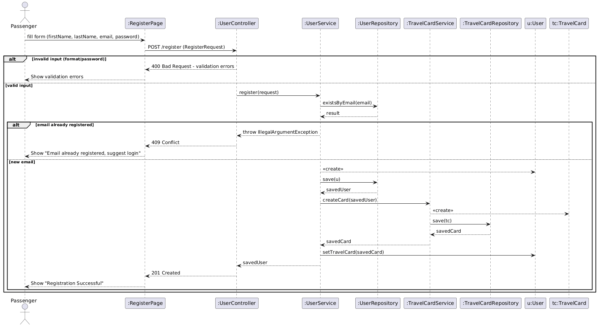

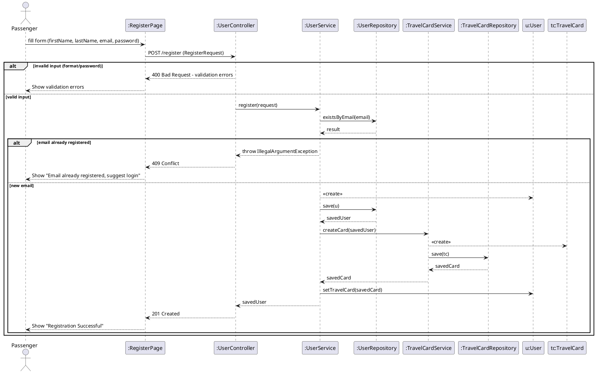
```plantuml
@startuml
actor Passenger
participant ":RegisterPage" as UI
participant ":UserController" as UC
participant ":UserService" as US
participant ":UserRepository" as UR
participant ":TravelCardService" as TCS
participant ":TravelCardRepository" as TCR
participant "u:User" as U
participant "tc:TravelCard" as TC

Passenger -> UI : fill form (firstName, lastName, email, password)
UI -> UC : POST /register (RegisterRequest)

alt invalid input (format/password)
    UC --> UI : 400 Bad Request - validation errors
    UI --> Passenger : Show validation errors
else valid input
    UC -> US : register(request)
    US -> UR : existsByEmail(email)
    UR --> US : result

    alt email already registered
        US --> UC : throw IllegalArgumentException
        UC --> UI : 409 Conflict
        UI --> Passenger : Show "Email already registered, suggest login"
    else new email
        US --> U : <<create>>
        US -> UR : save(u)
        UR --> US : savedUser
        US -> TCS : createCard(savedUser)
        TCS --> TC : <<create>>
        TCS -> TCR : save(tc)
        TCR --> TCS : savedCard
        TCS --> US : savedCard
        US -> U : setTravelCard(savedCard)
        US --> UC : savedUser
        UC --> UI : 201 Created
        UI --> Passenger : Show "Registration Successful"
    end
end
@enduml
```

### UC2. Login

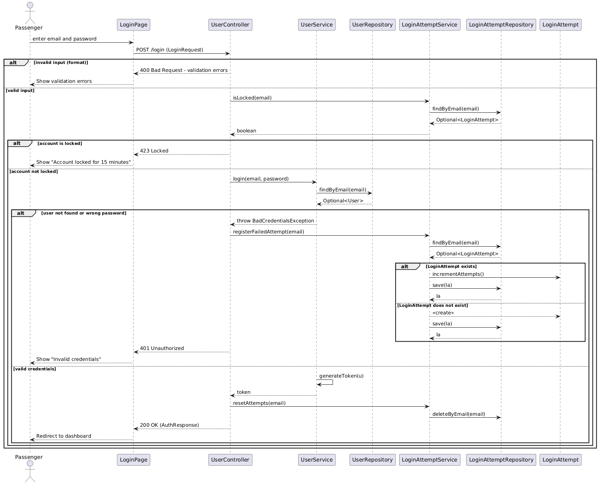

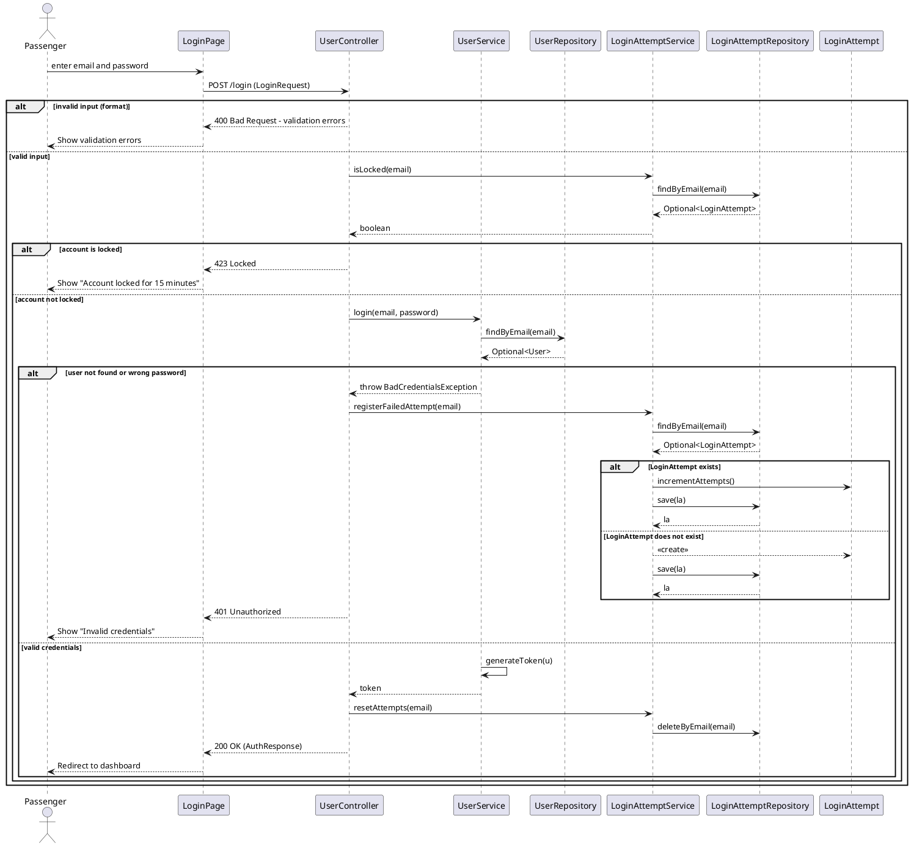
```plantuml
@startuml
actor Passenger
participant "LoginPage" as UI
participant "UserController" as UC
participant "UserService" as US
participant "UserRepository" as UR
participant "LoginAttemptService" as LAS
participant "LoginAttemptRepository" as LAR
participant "LoginAttempt" as LA

Passenger -> UI : enter email and password
UI -> UC : POST /login (LoginRequest)

alt invalid input (format)
    UC --> UI : 400 Bad Request - validation errors
    UI --> Passenger : Show validation errors
else valid input
    UC -> LAS : isLocked(email)
    LAS -> LAR : findByEmail(email)
    LAR --> LAS : Optional<LoginAttempt>
    LAS --> UC : boolean

    alt account is locked
        UC --> UI : 423 Locked
        UI --> Passenger : Show "Account locked for 15 minutes"
    else account not locked
        UC -> US : login(email, password)
        US -> UR : findByEmail(email)
        UR --> US : Optional<User>

        alt user not found or wrong password
            US --> UC : throw BadCredentialsException
            UC -> LAS : registerFailedAttempt(email)
            LAS -> LAR : findByEmail(email)
            LAR --> LAS : Optional<LoginAttempt>
            alt LoginAttempt exists
                LAS -> LA : incrementAttempts()
                LAS -> LAR : save(la)
                LAR --> LAS : la
            else LoginAttempt does not exist
                LAS --> LA : <<create>>
                LAS -> LAR : save(la)
                LAR --> LAS : la
            end
            UC --> UI : 401 Unauthorized
            UI --> Passenger : Show "Invalid credentials"
        else valid credentials
            US -> US : generateToken(u)
            US --> UC : token
            UC -> LAS : resetAttempts(email)
            LAS -> LAR : deleteByEmail(email)
            UC --> UI : 200 OK (AuthResponse)
            UI --> Passenger : Redirect to dashboard
        end
    end
end
@enduml
```

### UC3. Top-up travel card


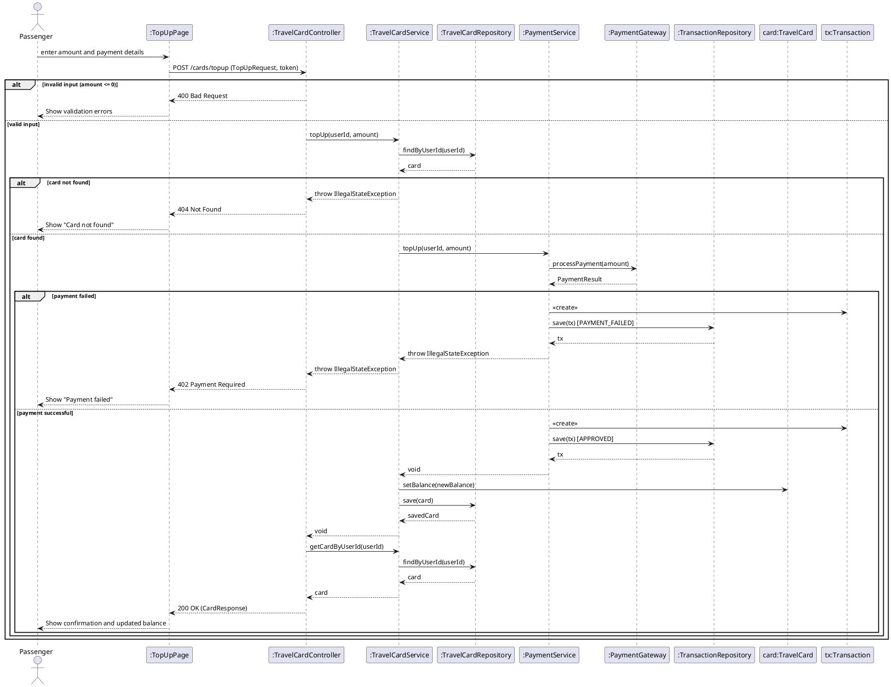
```plantuml
@startuml
actor Passenger
participant ":TopUpPage" as UI
participant ":TravelCardController" as TCC
participant ":TravelCardService" as TCS
participant ":TravelCardRepository" as TCR
participant ":PaymentService" as PS
participant ":PaymentGateway" as PG
participant ":TransactionRepository" as TR
participant "card:TravelCard" as TC
participant "tx:Transaction" as TX

Passenger -> UI : enter amount and payment details
UI -> TCC : POST /cards/topup (TopUpRequest, token)

alt invalid input (amount <= 0)
    TCC --> UI : 400 Bad Request
    UI --> Passenger : Show validation errors
else valid input
    TCC -> TCS : topUp(userId, amount)
    TCS -> TCR : findByUserId(userId)
    TCR --> TCS : card

    alt card not found
        TCS --> TCC : throw IllegalStateException
        TCC --> UI : 404 Not Found
        UI --> Passenger : Show "Card not found"
    else card found
        TCS -> PS : topUp(userId, amount)
        PS -> PG : processPayment(amount)
        PG --> PS : PaymentResult

        alt payment failed
            PS -> TX : <<create>>
            PS -> TR : save(tx) [PAYMENT_FAILED]
            TR --> PS : tx
            PS --> TCS : throw IllegalStateException
            TCS --> TCC : throw IllegalStateException
            TCC --> UI : 402 Payment Required
            UI --> Passenger : Show "Payment failed"
        else payment successful
            PS -> TX : <<create>>
            PS -> TR : save(tx) [APPROVED]
            TR --> PS : tx
            PS --> TCS : void
            TCS -> TC : setBalance(newBalance)
            TCS -> TCR : save(card)
            TCR --> TCS : savedCard
            TCS --> TCC : void
            TCC -> TCS : getCardByUserId(userId)
            TCS -> TCR : findByUserId(userId)
            TCR --> TCS : card
            TCS --> TCC : card
            TCC --> UI : 200 OK (CardResponse)
            UI --> Passenger : Show confirmation and updated balance
        end
    end
end
@enduml
```

### UC4. Purchase Ticket

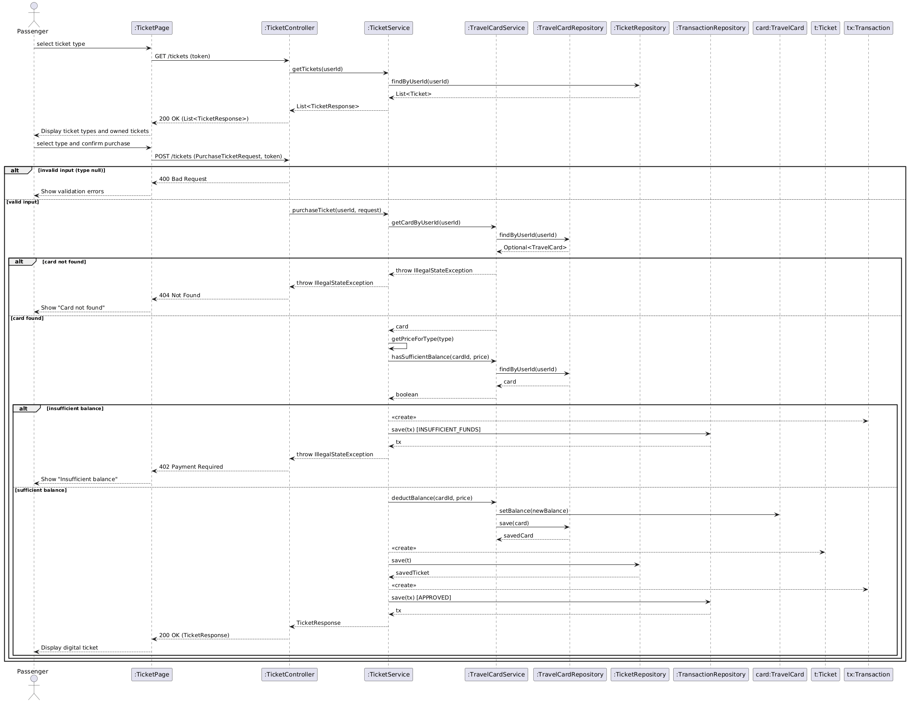

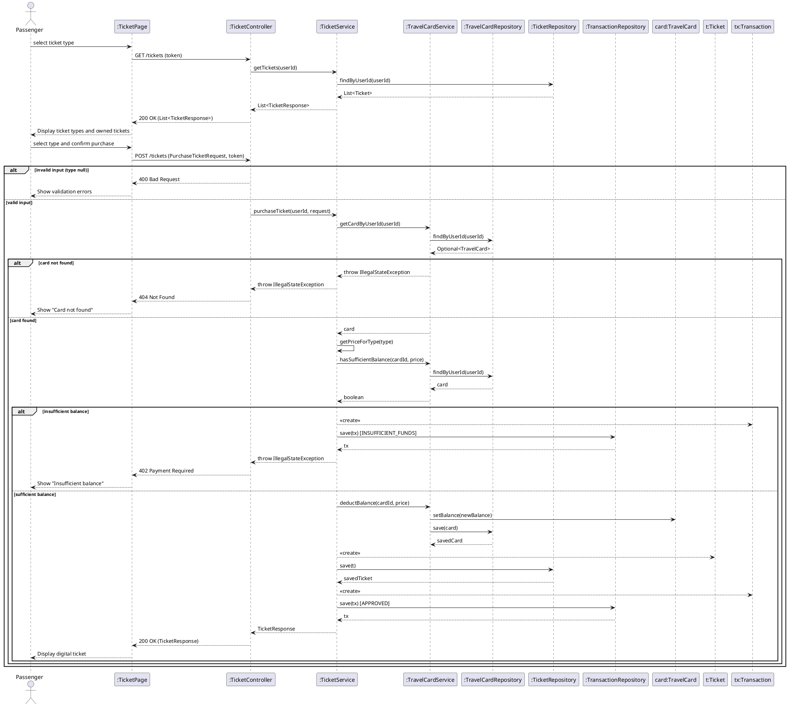
```plantuml
@startuml
actor Passenger
participant ":TicketPage" as UI
participant ":TicketController" as TC
participant ":TicketService" as TS
participant ":TravelCardService" as TCS
participant ":TravelCardRepository" as TCR
participant ":TicketRepository" as TR
participant ":TransactionRepository" as TXR
participant "card:TravelCard" as Card
participant "t:Ticket" as T
participant "tx:Transaction" as TX

Passenger -> UI : select ticket type
UI -> TC : GET /tickets (token)
TC -> TS : getTickets(userId)
TS -> TR : findByUserId(userId)
TR --> TS : List<Ticket>
TS --> TC : List<TicketResponse>
TC --> UI : 200 OK (List<TicketResponse>)
UI --> Passenger : Display ticket types and owned tickets

Passenger -> UI : select type and confirm purchase
UI -> TC : POST /tickets (PurchaseTicketRequest, token)

alt invalid input (type null)
    TC --> UI : 400 Bad Request
    UI --> Passenger : Show validation errors
else valid input
    TC -> TS : purchaseTicket(userId, request)
    TS -> TCS : getCardByUserId(userId)
    TCS -> TCR : findByUserId(userId)
    TCR --> TCS : Optional<TravelCard>

    alt card not found
        TCS --> TS : throw IllegalStateException
        TS --> TC : throw IllegalStateException
        TC --> UI : 404 Not Found
        UI --> Passenger : Show "Card not found"
    else card found
        TCS --> TS : card
        TS -> TS : getPriceForType(type)
        TS -> TCS : hasSufficientBalance(cardId, price)
        TCS -> TCR : findByUserId(userId)
        TCR --> TCS : card
        TCS --> TS : boolean

        alt insufficient balance
            TS --> TX : <<create>>
            TS -> TXR : save(tx) [INSUFFICIENT_FUNDS]
            TXR --> TS : tx
            TS --> TC : throw IllegalStateException
            TC --> UI : 402 Payment Required
            UI --> Passenger : Show "Insufficient balance"
        else sufficient balance
            TS -> TCS : deductBalance(cardId, price)
            TCS -> Card : setBalance(newBalance)
            TCS -> TCR : save(card)
            TCR --> TCS : savedCard
            TS --> T : <<create>>
            TS -> TR : save(t)
            TR --> TS : savedTicket
            TS --> TX : <<create>>
            TS -> TXR : save(tx) [APPROVED]
            TXR --> TS : tx
            TS --> TC : TicketResponse
            TC --> UI : 200 OK (TicketResponse)
            UI --> Passenger : Display digital ticket
        end
    end
end
@enduml
```

### UC5. Plan Journey

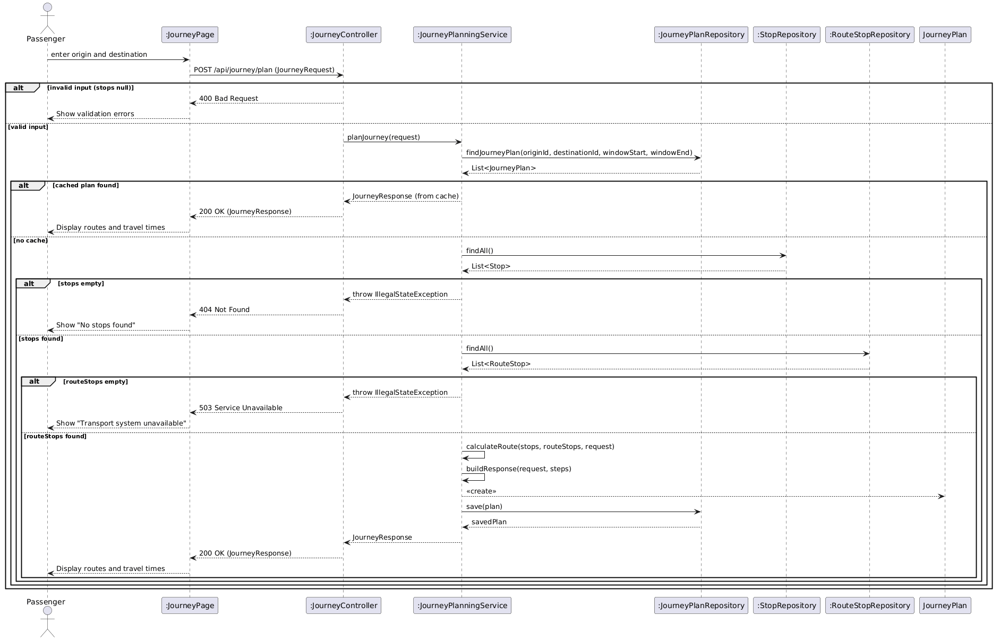

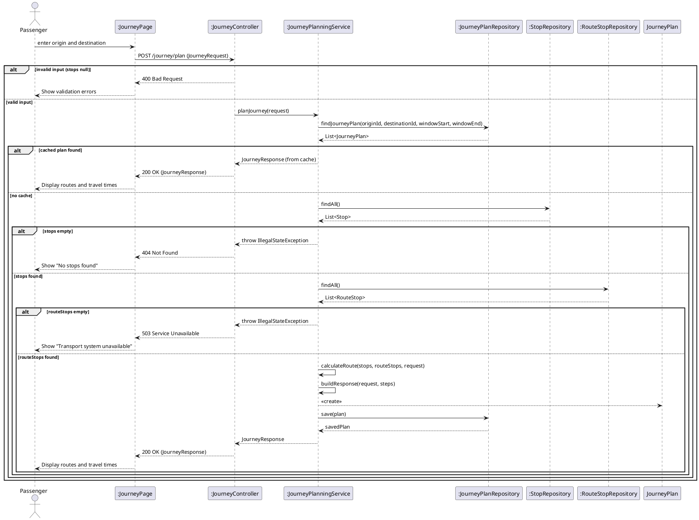
```plantuml
@startuml
actor Passenger
participant ":JourneyPage" as UI
participant ":JourneyController" as JC
participant ":JourneyPlanningService" as JPS
participant ":JourneyPlanRepository" as JPR
participant ":StopRepository" as SR
participant ":RouteStopRepository" as RSR
participant "JourneyPlan" as JP

Passenger -> UI : enter origin and destination
UI -> JC : POST /journey/plan (JourneyRequest)

alt invalid input (stops null)
    JC --> UI : 400 Bad Request
    UI --> Passenger : Show validation errors
else valid input
    JC -> JPS : planJourney(request)

    JPS -> JPR : findJourneyPlan(originId, destinationId, windowStart, windowEnd)
    JPR --> JPS : List<JourneyPlan>

    alt cached plan found
        JPS --> JC : JourneyResponse (from cache)
        JC --> UI : 200 OK (JourneyResponse)
        UI --> Passenger : Display routes and travel times
    else no cache
        JPS -> SR : findAll()
        SR --> JPS : List<Stop>

        alt stops empty
            JPS --> JC : throw IllegalStateException
            JC --> UI : 404 Not Found
            UI --> Passenger : Show "No stops found"
        else stops found
            JPS -> RSR : findAll()
            RSR --> JPS : List<RouteStop>

            alt routeStops empty
                JPS --> JC : throw IllegalStateException
                JC --> UI : 503 Service Unavailable
                UI --> Passenger : Show "Transport system unavailable"
            else routeStops found
                JPS -> JPS : calculateRoute(stops, routeStops, request)
                JPS -> JPS : buildResponse(request, steps)
                JPS --> JP : <<create>>
                JPS -> JPR : save(plan)
                JPR --> JPS : savedPlan
                JPS --> JC : JourneyResponse
                JC --> UI : 200 OK (JourneyResponse)
                UI --> Passenger : Display routes and travel times
            end
        end
    end
end
@enduml
```

### UC6. View Real-time Transport Info

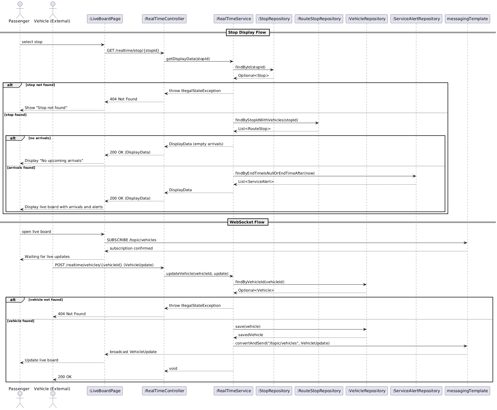

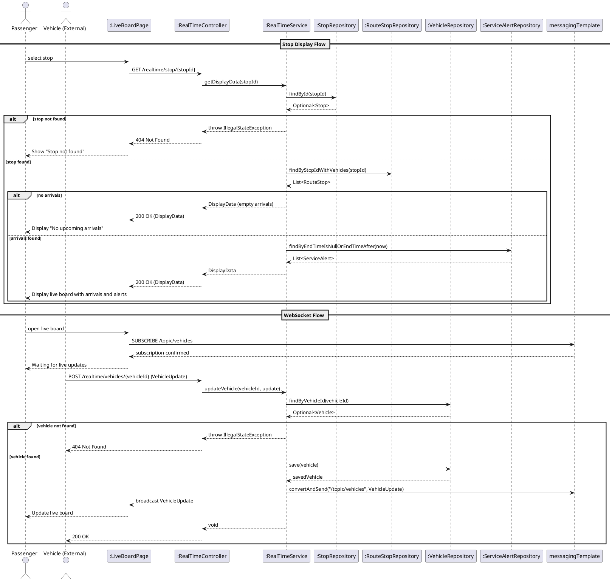
```plantuml
@startuml
actor Passenger
actor Vehicle as "Vehicle (External)"
participant ":LiveBoardPage" as UI
participant ":RealTimeController" as RTC
participant ":RealTimeService" as RTS
participant ":StopRepository" as SR
participant ":RouteStopRepository" as RSR
participant ":VehicleRepository" as VR
participant ":ServiceAlertRepository" as SAR
participant "messagingTemplate" as WS

== Stop Display Flow ==
Passenger -> UI : select stop
UI -> RTC : GET /realtime/stop/{stopId}
RTC -> RTS : getDisplayData(stopId)
RTS -> SR : findById(stopId)
SR --> RTS : Optional<Stop>

alt stop not found
    RTS --> RTC : throw IllegalStateException
    RTC --> UI : 404 Not Found
    UI --> Passenger : Show "Stop not found"
else stop found
    RTS -> RSR : findByStopIdWithVehicles(stopId)
    RSR --> RTS : List<RouteStop>

    alt no arrivals
        RTS --> RTC : DisplayData (empty arrivals)
        RTC --> UI : 200 OK (DisplayData)
        UI --> Passenger : Display "No upcoming arrivals"
    else arrivals found
        RTS -> SAR : findByEndTimeIsNullOrEndTimeAfter(now)
        SAR --> RTS : List<ServiceAlert>
        RTS --> RTC : DisplayData
        RTC --> UI : 200 OK (DisplayData)
        UI --> Passenger : Display live board with arrivals and alerts
    end
end

== WebSocket Flow ==
Passenger -> UI : open live board
UI -> WS : SUBSCRIBE /topic/vehicles
WS --> UI : subscription confirmed
UI --> Passenger : Waiting for live updates

Vehicle -> RTC : POST /realtime/vehicles/{vehicleId} (VehicleUpdate)
RTC -> RTS : updateVehicle(vehicleId, update)
RTS -> VR : findByVehicleId(vehicleId)
VR --> RTS : Optional<Vehicle>

alt vehicle not found
    RTS --> RTC : throw IllegalStateException
    RTC --> Vehicle : 404 Not Found
else vehicle found
    RTS -> VR : save(vehicle)
    VR --> RTS : savedVehicle
    RTS -> WS : convertAndSend("/topic/vehicles", VehicleUpdate)
    WS --> UI : broadcast VehicleUpdate
    UI --> Passenger : Update live board
    RTS --> RTC : void
    RTC --> Vehicle : 200 OK
end
@enduml
```

### UC7. Validate Ticket

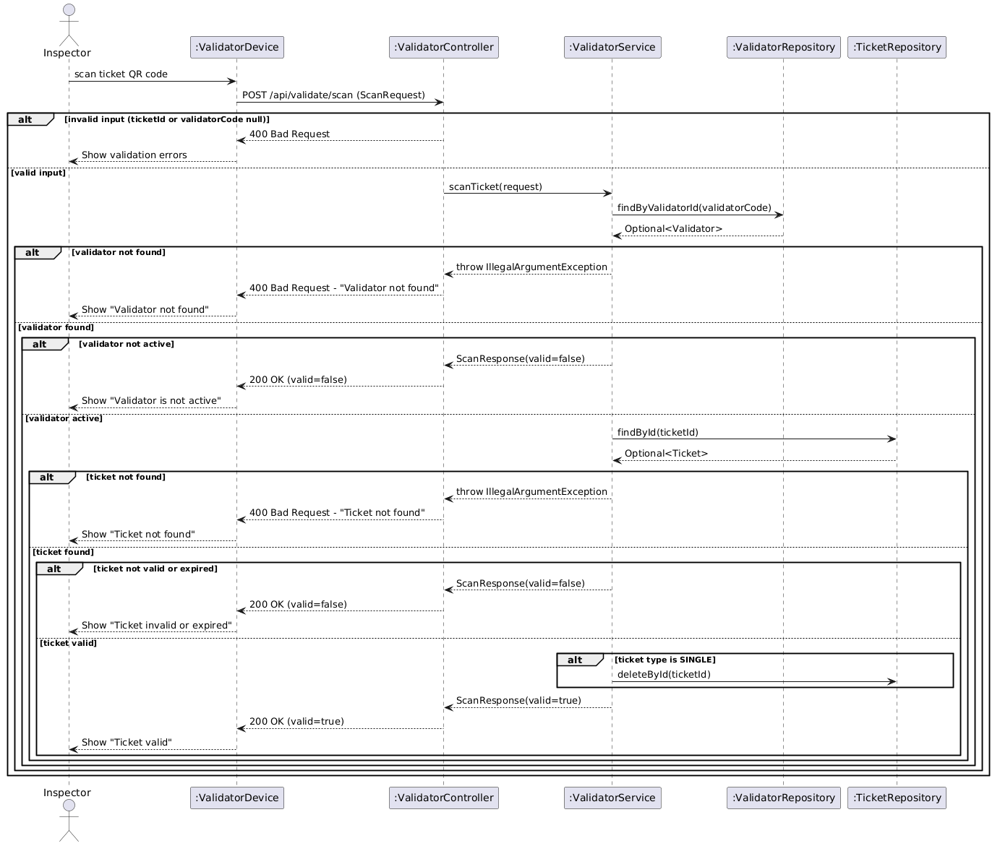

```palntuml
@startuml
actor Inspector
participant ":ValidatorDevice" as UI
participant ":ValidatorController" as VC
participant ":ValidatorService" as VS
participant ":ValidatorRepository" as VR
participant ":TicketRepository" as TR

Inspector -> UI : scan ticket QR code
UI -> VC : POST /api/validate/scan (ScanRequest)

alt invalid input (ticketId or validatorCode null)
    VC --> UI : 400 Bad Request
    UI --> Inspector : Show validation errors
else valid input
    VC -> VS : scanTicket(request)
    VS -> VR : findByValidatorId(validatorCode)
    VR --> VS : Optional<Validator>

    alt validator not found
        VS --> VC : throw IllegalArgumentException
        VC --> UI : 400 Bad Request - "Validator not found"
        UI --> Inspector : Show "Validator not found"
    else validator found
        alt validator not active
            VS --> VC : ScanResponse(valid=false)
            VC --> UI : 200 OK (valid=false)
            UI --> Inspector : Show "Validator is not active"
        else validator active
            VS -> TR : findById(ticketId)
            TR --> VS : Optional<Ticket>

            alt ticket not found
                VS --> VC : throw IllegalArgumentException
                VC --> UI : 400 Bad Request - "Ticket not found"
                UI --> Inspector : Show "Ticket not found"
            else ticket found
                alt ticket not valid or expired
                    VS --> VC : ScanResponse(valid=false)
                    VC --> UI : 200 OK (valid=false)
                    UI --> Inspector : Show "Ticket invalid or expired"
                else ticket valid
                    alt ticket type is SINGLE
                        VS -> TR : deleteById(ticketId)
                    end
                    VS --> VC : ScanResponse(valid=true)
                    VC --> UI : 200 OK (valid=true)
                    UI --> Inspector : Show "Ticket valid"
                end
            end
        end
    end
end
@enduml
```

### UC8. Receive Notifications

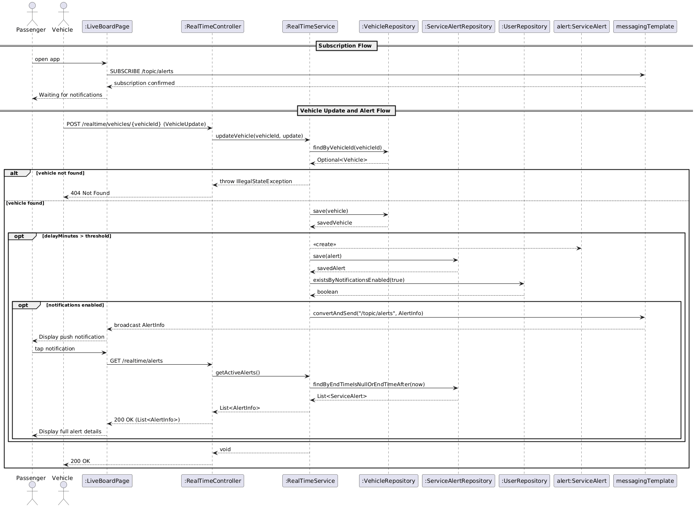

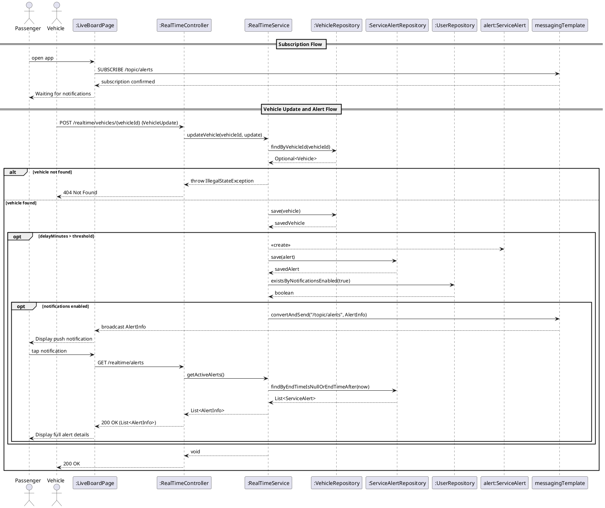
```plantuml
@startuml
actor Passenger
actor Vehicle 
participant ":LiveBoardPage" as UI
participant ":RealTimeController" as RTC
participant ":RealTimeService" as RTS
participant ":VehicleRepository" as VR
participant ":ServiceAlertRepository" as SAR
participant ":UserRepository" as UR
participant "alert:ServiceAlert" as SA
participant "messagingTemplate" as WS

== Subscription Flow ==
Passenger -> UI : open app
UI -> WS : SUBSCRIBE /topic/alerts
WS --> UI : subscription confirmed
UI --> Passenger : Waiting for notifications

== Vehicle Update and Alert Flow ==
Vehicle -> RTC : POST /realtime/vehicles/{vehicleId} (VehicleUpdate)
RTC -> RTS : updateVehicle(vehicleId, update)
RTS -> VR : findByVehicleId(vehicleId)
VR --> RTS : Optional<Vehicle>

alt vehicle not found
    RTS --> RTC : throw IllegalStateException
    RTC --> Vehicle : 404 Not Found
else vehicle found
    RTS -> VR : save(vehicle)
    VR --> RTS : savedVehicle

    opt delayMinutes > threshold
        RTS --> SA : <<create>>
        RTS -> SAR : save(alert)
        SAR --> RTS : savedAlert
        RTS -> UR : existsByNotificationsEnabled(true)
        UR --> RTS : boolean

        opt notifications enabled
            RTS -> WS : convertAndSend("/topic/alerts", AlertInfo)
            WS --> UI : broadcast AlertInfo
            UI --> Passenger : Display push notification
            Passenger -> UI : tap notification
            UI -> RTC : GET /realtime/alerts
            RTC -> RTS : getActiveAlerts()
            RTS -> SAR : findByEndTimeIsNullOrEndTimeAfter(now)
            SAR --> RTS : List<ServiceAlert>
            RTS --> RTC : List<AlertInfo>
            RTC --> UI : 200 OK (List<AlertInfo>)
            UI --> Passenger : Display full alert details
        end
    end

    RTS --> RTC : void
    RTC --> Vehicle : 200 OK
end
@enduml
```

## 3c. Statechart diagram
We will take `Ticket` as a class for building statechart diagram.

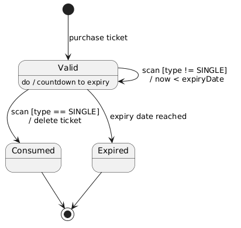

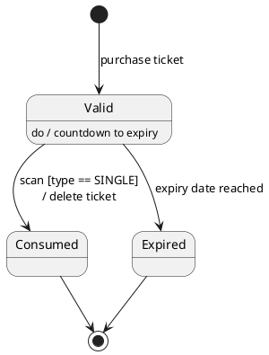
```plantuml
@startuml
[*] --> Valid : purchase ticket

Valid : do / countdown to expiry

Valid --> Consumed : scan [type == SINGLE]\n/ delete ticket

Valid --> Expired : expiry date reached

Expired --> [*]
Consumed --> [*]
@enduml
```

## 3d. Software architecture

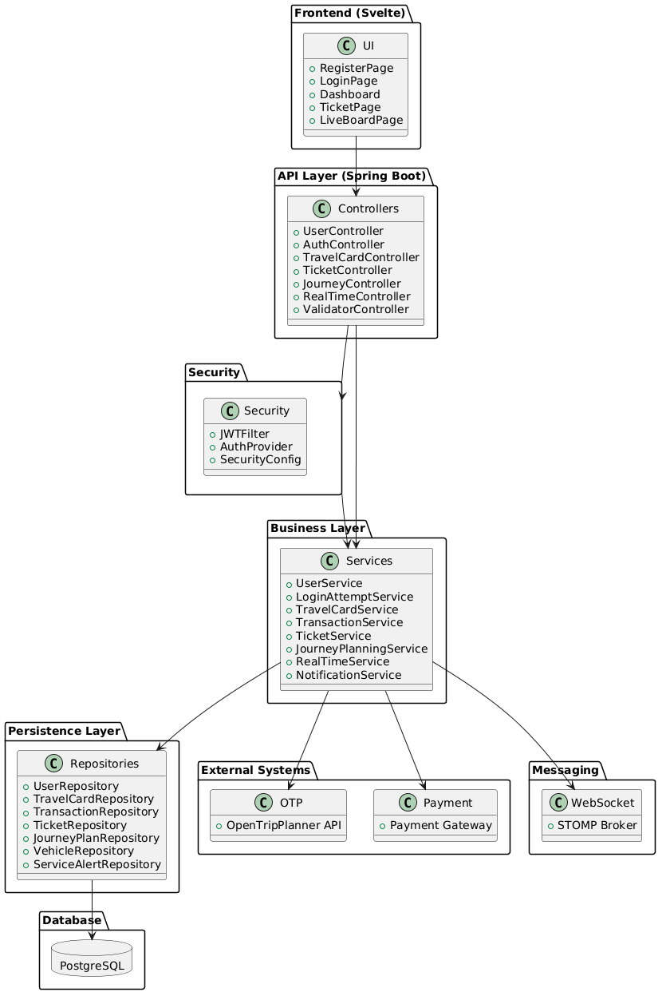

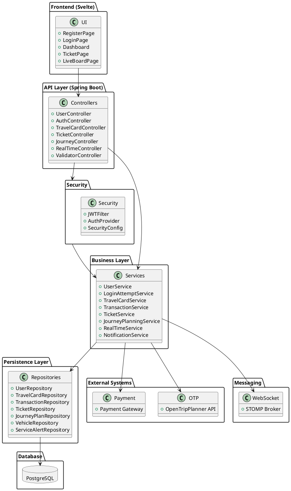
```plantuml
@startuml
allowmixing
!define RECTANGLE class

package "Frontend (Svelte)" {
    RECTANGLE UI {
        +RegisterPage
        +LoginPage
        +Dashboard
        +TicketPage
        +LiveBoardPage
    }
}

package "API Layer (Spring Boot)" {
    RECTANGLE Controllers {
        +UserController
        +AuthController
        +TravelCardController
        +TicketController
        +JourneyController
        +RealTimeController
        +ValidatorController
    }
}

package "Security" {
    RECTANGLE Security {
        +JWTFilter
        +AuthProvider
        +SecurityConfig
    }
}

package "Business Layer" {
    RECTANGLE Services {
        +UserService
        +LoginAttemptService
        +TravelCardService
        +TransactionService
        +TicketService
        +JourneyPlanningService
        +RealTimeService
        +NotificationService
    }
}

package "Persistence Layer" {
    RECTANGLE Repositories {
        +UserRepository
        +TravelCardRepository
        +TransactionRepository
        +TicketRepository
        +JourneyPlanRepository
        +VehicleRepository
        +ServiceAlertRepository
    }
}

package "Database" {
    database "PostgreSQL"
}

package "External Systems" {
    RECTANGLE OTP {
        +OpenTripPlanner API
    }

    RECTANGLE Payment {
        +Payment Gateway
    }
}

package "Messaging" {
    RECTANGLE WebSocket {
        +STOMP Broker
    }
}

' Relationships
UI --> Controllers
Controllers --> Services
Services --> Repositories
Repositories --> "PostgreSQL"

Services --> OTP
Services --> Payment
Services --> WebSocket

Controllers --> Security
Security --> Services

@enduml
```